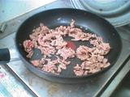
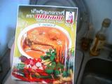
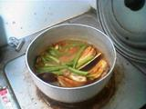
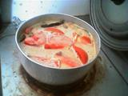

+++
title = "クリスマスの夜はイエローカレー"
date = 2004-12-25T00:00:00+09:00
categories = ["life"]
tags = []
+++

今回は牛肉を使用してみる。

これまでと同様、なすをよく炒める。

これがイエローペースト。グリーンやレッドに比べてにおいがきつい。

肉と、トマト以外の野菜を先に入れる。

トマトを入れてできあがり。
