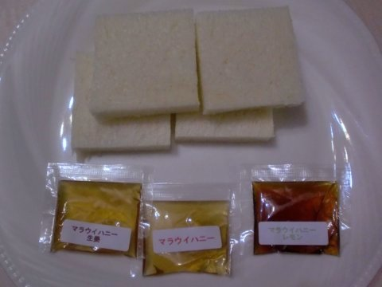

# マラウイのハチミツの試供品が来ました

Update: 2010-04-29

マラウイのハチミツの2回目の注文が届きました。その中に試供品の「マラウイハニー」「マラウイハニー 生姜」「マラウイハニー レモン」が入っていたので味見してみました。

マラウイハニー 生姜

生姜の味がかなり効いています。からいかなと感じるくらいです。後味はさわやかです。

マラウイハニー レモン

もとのマラウイハニーが、マンゴーやナッツ類の蜜のワイルドな味なのですが、それに柑橘の味が加わって、華やかです。

マラウイハニー

素でもワイルドな味なのですが、生姜とレモンを食べた後では普通に感じます。

商品の購入はこちらから http://www.malawi.jp/

フェアトレードの取り組みの紹介なども紹介しています。
