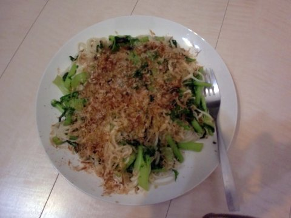

+++
title = "大根の葉と素麺で作った何か"
date = 2010-11-06T00:00:00+09:00
categories = ["life"]
tags = []
+++

青々した大根の葉をどうしようかと考えた結果、炒めたそうめんに乗せて鰹節をふって食べることにしました。そうめんはかなり太めの半田そうめんです。東日本の人にはそうめんというより稲庭うどんの方がイメージが合うかもしれません。
