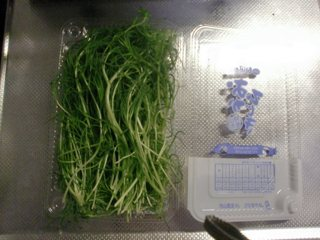
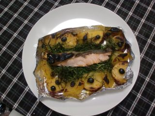

# サツマイモとリンゴのみかんジュース煮と鮭を焼いて。。。

Update: 2011-11-04

昨日作ったばかりの [サツマイモとリンゴのみかんジュース煮](20111103.md) と、鮭をいっしょに焼いてみました。これも Facebook で [Yukari](https://www.facebook.com/yukari.rich) さんに教えてもらったもの、と言っていいのかな？今回は材料が少々違います。

帰宅してから 買い物に行って「なんだこれ？」と思わず手に取ってしまったのが「山形特産おかひじき」です。見たことあるような気もするのだけど、自分で料理に使ったことはありません。体によさそうな雰囲気なのでとりあえず買って帰りました。

アルミホイルの端をつまんで周りにサツマイモとリンゴを並べて、レーズンを散らして、煮詰まったみかんジュースをかけます。オカヒジキを 3 〜 5cm くらいに切ったものを敷いて、その上に鮭をおいて、塩、こしょう、オリーブオイルをふりかけてオーブンに。

鮭は火が通りやすいので、すぐできました。オカヒジキもいい感じです。
