# Facebookの投稿の表示範囲の変更

Update: 2021-05-17

Facebookを使っているみなさんは、自分の投稿を表示する範囲の設定があるのをご存知でしょうか？
最近、どうもその人の意図する形になってないなと気になったことがありました。以下、その設定方法です。

## A. 投稿済みの記事の変更

表示する範囲は投稿した後でも変更できます。ただし、すでに他の人のコメントなどがついている場合は、表示する範囲を広げていいかどうか一考してからにしてください。

表示する範囲がどうなっているかはここを見てください。下の例のように地球のマークの場合はすべての人に「公開」です。鍵のマークの場合は非公開です。それ以外の場合は友達など限ってに表示する設定になっています。

まず、投稿の右上の「・・・」を押します。

次に、「プライバシー設定を編集」を押します。

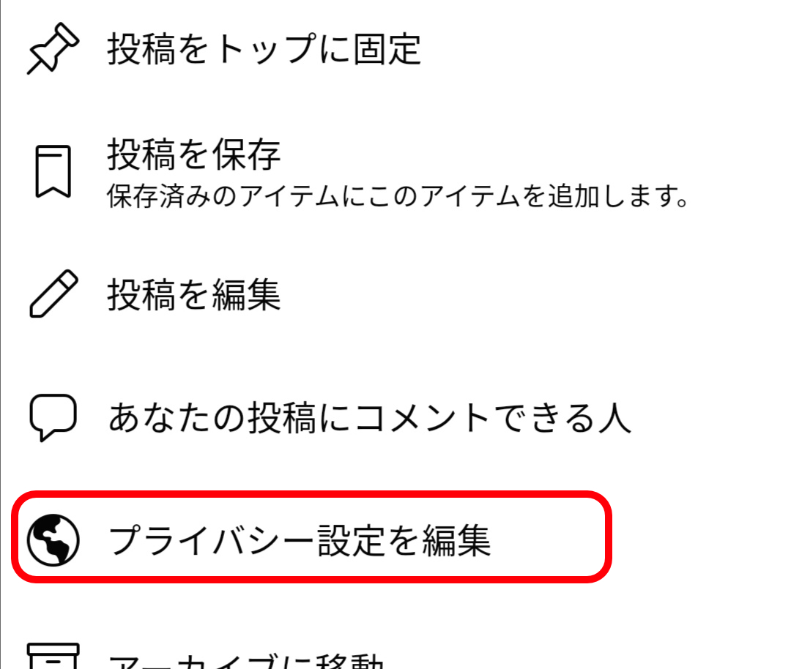

「公開」や「友達」などの設定を選んでください。

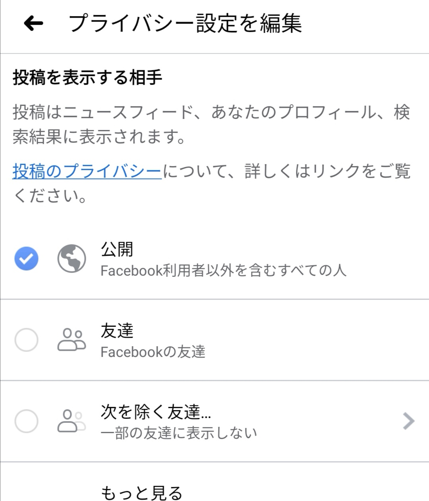

記事に戻って表示する範囲が意図する形になっていることを確認してください。

以上です。

## B. これから投稿する記事の設定

投稿するたびに毎回この設定を変更するのは面倒です。設定し忘れてしまうこともありますし。以下の手順でデフォルトの設定を変更できます。

まず、Facebookのアプリの右上の「三」を押します。

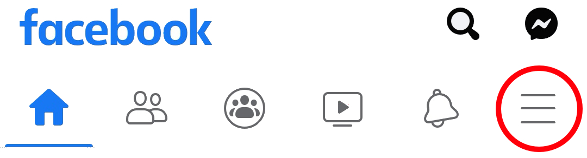

下の方にある「設定とプライバシー」を押します。

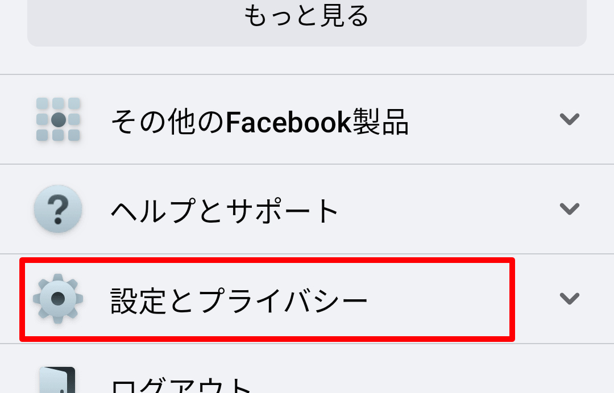

次に「設定」を押します。

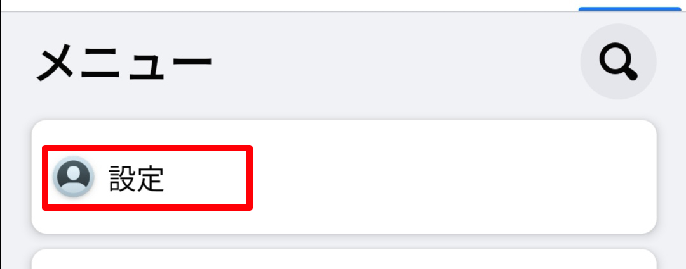

「プライバシー設定」を押します。

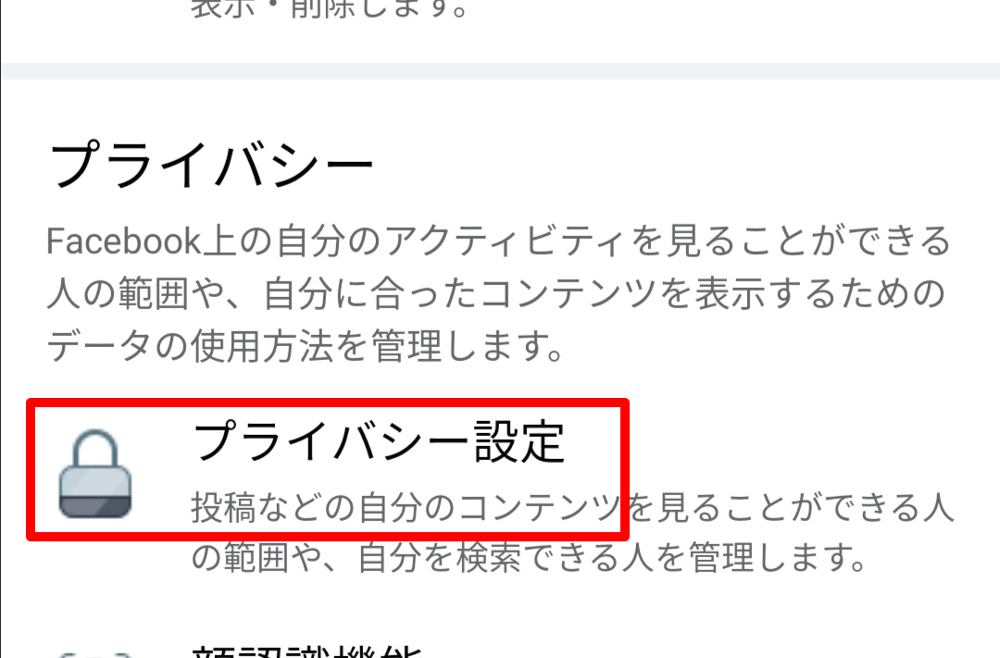

プライバシーセンターの「＞」を押します。

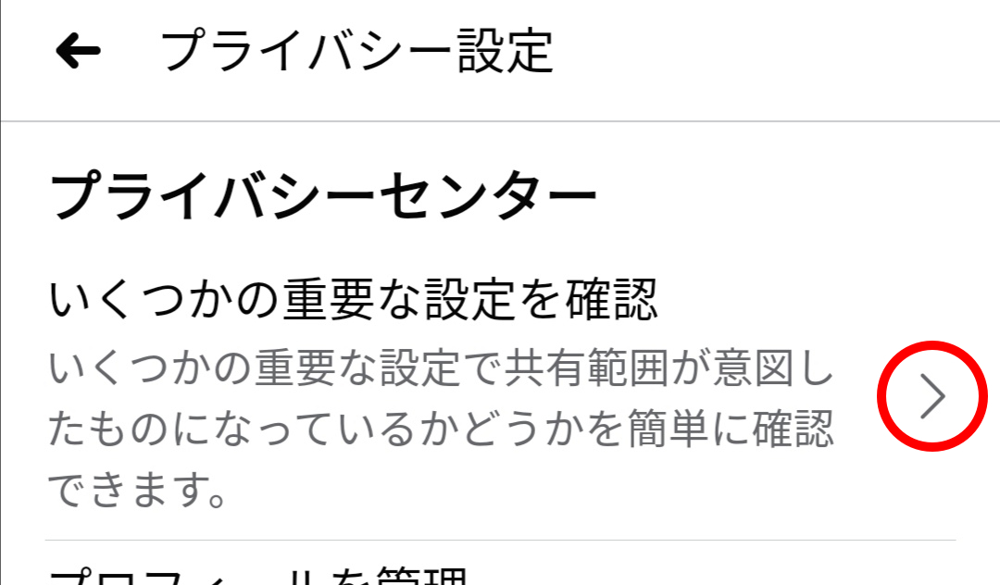

「コンテンツのプライパシー設定」を押します。

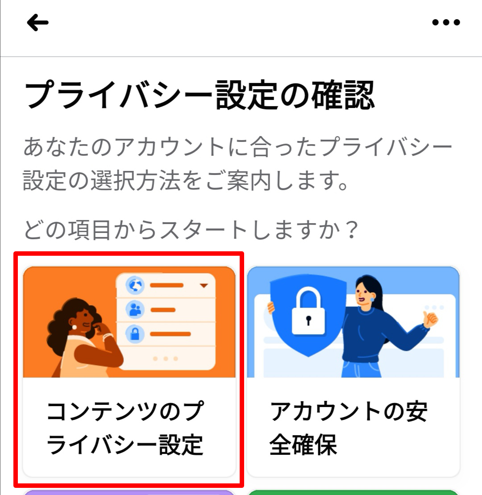

一番下の「次へ」を押します。

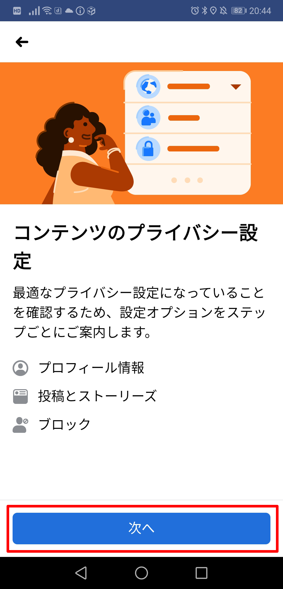

次に表示される「プロフィール情報」は今回は関係ないのですが、ついでに電話番号やメールアドレスなどの内容と、その表示の範囲（公開・友達・自分のみ）を確認しておいてください。

確認したら「次へ」を押します。

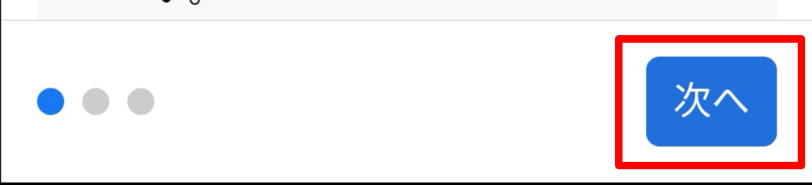

ようやく目的の場所にたどりつきました。ここで「今後の投稿」と「ストーリーズ」の表示範囲を設定します。「ストーリーズ」は私はよくわからなくて使ったことがありません。1日経つと自動で消えるようですね。

設定できたら「次へ」を押します。

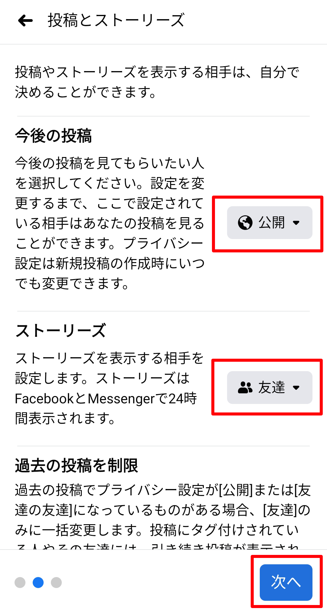

もう一度「次へ」を押すと、

「完了です」が表示されます。

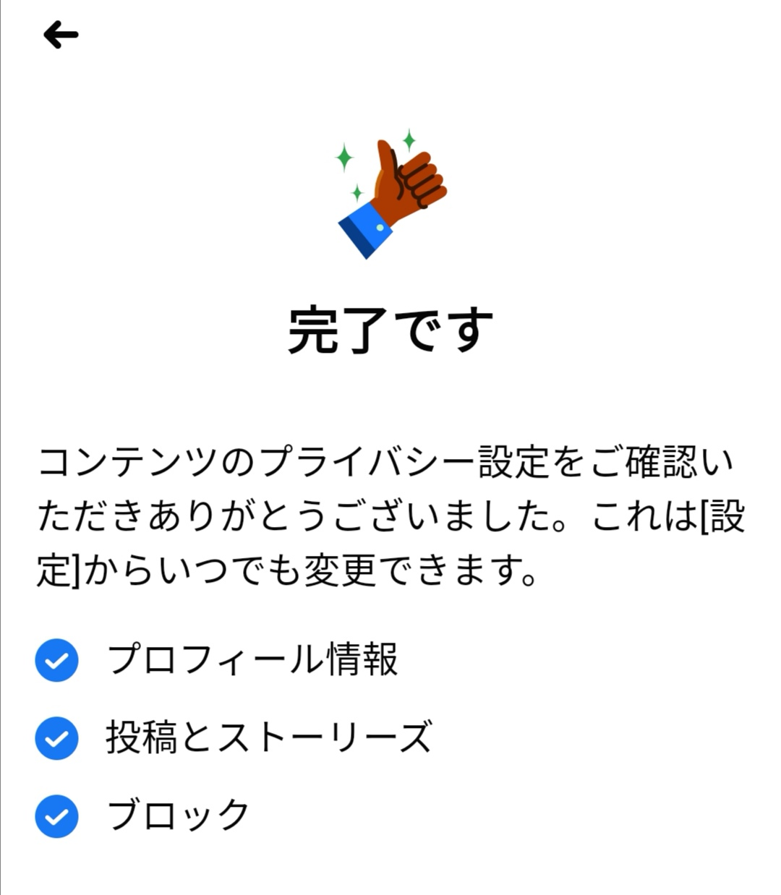

確認のために、「プライバシーセンター」まで戻って、「プライバシー基本ガイドで詳細を確認」の「＞」を押します。

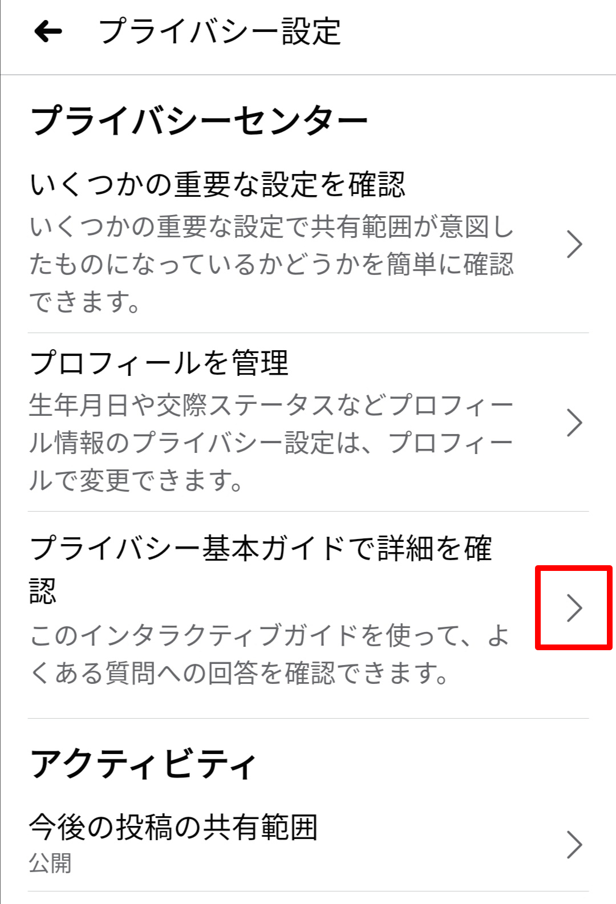

設定した結果が表示されます。

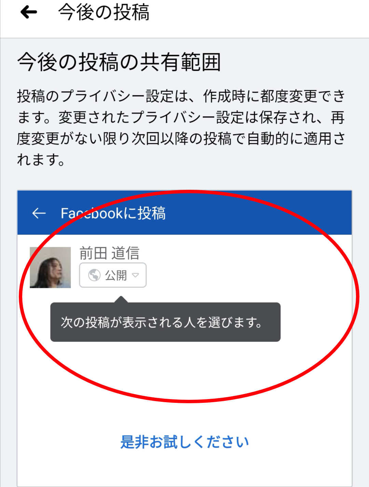

以上です。
