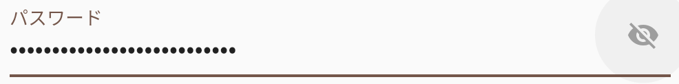
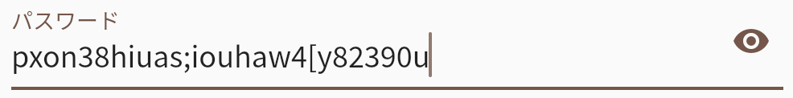

# Flutter でパスワードの表示を切り替えるボタン

Update: 2021-09-25





Flutter の Widget はこんな感じで作ればいいようです。お約束の ``key`` 以外に必要なプロパティを足して、
``createElement()`` で返します。

```
class VisibilityIconButton extends Widget {
  final bool visible;
  final VoidCallback onPressed;

  const VisibilityIconButton({
    Key? key,
    required this.visible,
    required this.onPressed,
  }) : super(key: key);

  @override
  Element createElement() {
    return IconButton(
      icon: Icon(
        visible ? Icons.visibility : Icons.visibility_off,
        color: visible ? null : Colors.grey,
      ),
      onPressed: onPressed,
    ).createElement();
  }
}
```

これを ``TextField`` や ``TextFormField`` の ``decoration`` でこんな風に使います。

```
      decoration: InputDecoration(
        label: const Text('パスワード'),
        suffixIcon: VisibilityIconButton(
          visible: _passwordVisible,
          onPressed: () {
            setState(() {
              _passwordVisible = !_passwordVisible;
            });
          },
        ),
      ),
```

1箇所だけならカスタム・ウィジットを作らなくてもいいんですが、複数箇所の場合はアイコンや色の指定をまとめてできますから。

Tag: flutter dart material
