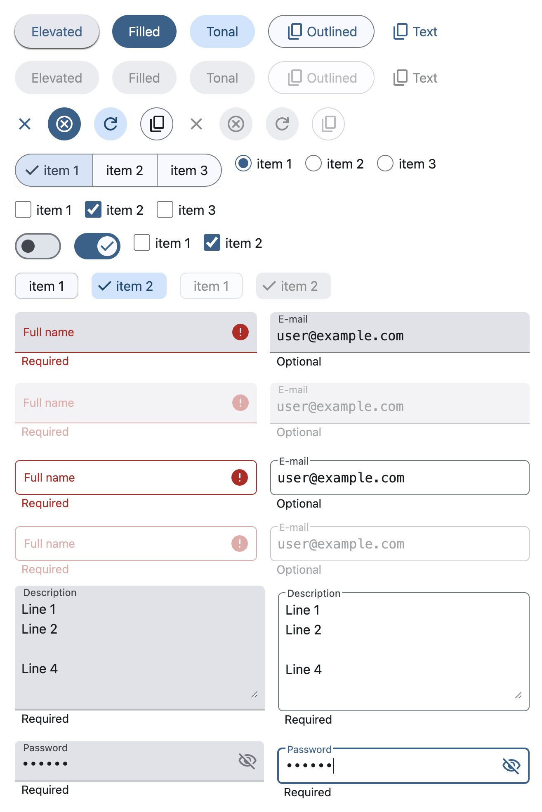

# Svelte 用の Material 3 風のコンポーネント

Update: 2024-10-25

[Tailwind 用の Material 3 Color Theme](20241019md3colors.html) の続きです。

[Mamba UI](https://mambaui.com/) や [HyperUI](https://www.hyperui.dev/) を参考に、
Material Design 3 にできるだけ近い形の Svelte のコンポーネントを作ってみました。
Dark mode にも対応しています。

Mamba UI や HyperUI を最初に見たときには「インストールする手順がないけど、どうやって使うの？」と戸惑いましたけれど、コピペしろとのことです。
私も今回使ったものは、他のところにコピペして使おうと思います。
Svelte のソースはほぼ HTML そのままなので Svelte 以外でも使えます。

<https://github.com/MichinobuMaeda/coarse-paper>

Tag: tailwind material
