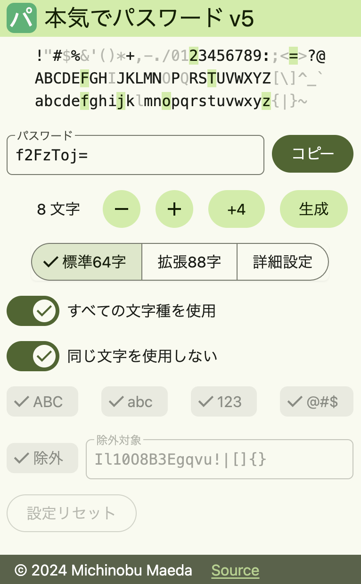

# 本気でパスワード v5

Update: 2024-10-27

[Svelte 用の Material 3 風のコンポーネント](20241025md3components.html) を使って「本気でパスワード v5」を作りました。
Flutter で作った [v4](https://github.com/MichinobuMaeda/honkipass) は起動が遅く、単機能に対してさすがに不釣り合いでした。

ソース: <https://github.com/MichinobuMaeda/honkipass5?tab=readme-ov-file>

実物: <https://honkipass.michinobu.jp/>

Tag: tailwind material
