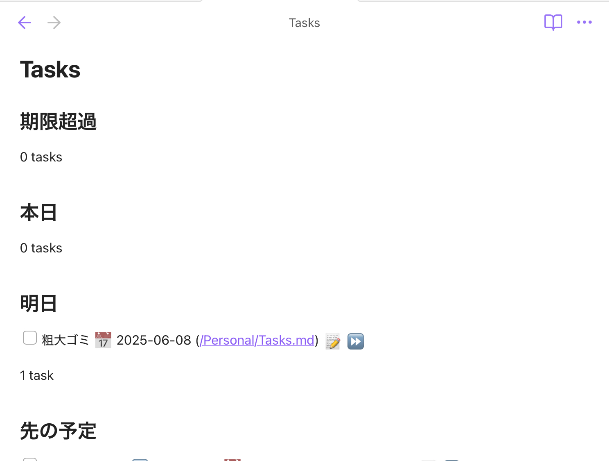

# Obsidian でタスク管理

Update: 2025-05-24

私の日常の情報整理にはセキュリティなどのリスクが低めだという理由で Obsidian を使っています（常駐の客先の仕事を除く）。Markdown のファイルとして保存されるので、将来 Obsidian が使えなくなってもデータはそのまま残ります。PDF の資料やスクリーンショットの画像なども Obsidian のフォルダに放り込んでいます。デバイス間の同期はプラグイン Remotely Save を使った OneDrive 経由で問題なくできています。

この Obsidian のプラグイン Tasks をしばらく使っていたのですが、最近になってやっと真面目にガイドを読んで使い方を変えて、いい感じになりました。

まず、次のような内容のファイルを Obsidian のフォルダのトップなど開きやすい場所に置きます。このファイルには直接タスクは記入しません。表示専用です。

<pre class="highlight"><code class="language-markdown"
>## 期限超過
&grave;&grave;&grave;tasks
due on or before yesterday
not done
&grave;&grave;&grave;

## 本日
&grave;&grave;&grave;tasks
due today
not done
&grave;&grave;&grave;

## 明日
&grave;&grave;&grave;tasks
due tomorrow
not done
&grave;&grave;&grave;

## 先の予定
&grave;&grave;&grave;tasks
due after tomorrow
not done
&grave;&grave;&grave;

## 済
&grave;&grave;&grave;tasks
done
&grave;&grave;&grave;</code></pre>

この設定内容は自分の好みで変えてください。

次に Obsidian のフォルダのどこでもいいので、実際のタスクを記載します。

```markdown
-   [ ]
```

のように書き始めると、日付や繰り返しなどの設定を書くためのガイドが出てきます。このファイルは別々の場所に複数置いてだいじょうぶです。何かの計画の文書の中に入れるといった使い方もできます。

最初に作ったファイルの表示はこんな感じです。



Tag: markdown obsidian
