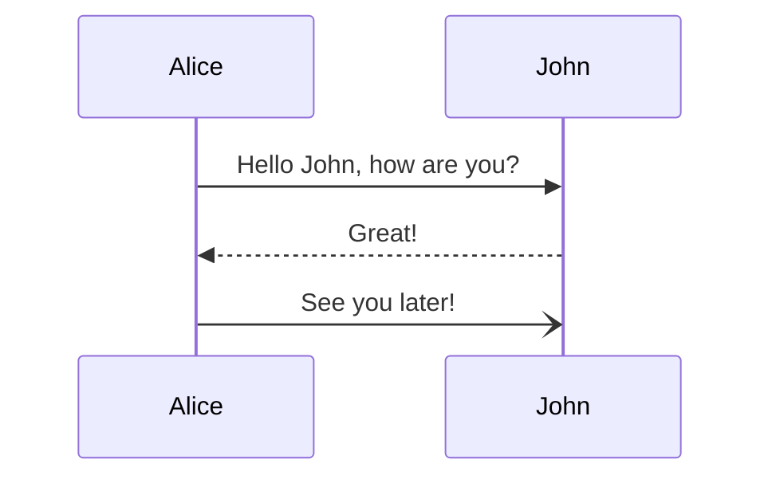

+++
title = "Hugo導入"
date = 2026-05-10T00:00:00+09:00
categories = ["tech"]
tags = ["hugo", "mermaid", "mathjax", "site-generatror"]
+++

このサイトは静的サイトジェネレーターで作って
[GitHub Pages で公開](https://github.com/MichinobuMaeda/MichinobuMaeda.github.io/)
しています。ジェネレーターはまず
Jekyll[^1]、その後 Pyhonでジェネレーターを自製[^2]、
Node.js で自製と変えていて、今回 [Hugo](https://gohugo.io/) を導入しました。

[^1]: [このサイトを GitHub Pages に引っ越し](githubpagesminimal.html)
[^2]: [Markdown の Mermaid をプラグイン無しで](20230206mermaid.html)

ほとんどの作業は VS Code + GitHub Coplilot + Claude Sonnet 4.6 に任せました。まず、

- Markdown のタイトル、日付、カテゴリー、タグを Hugo 用に一括変換
- CSS は流用
- テンプレートを Hugo 用に変更

で、旧版と寸分たがわぬものができました。

次に、タグクラウドでタグをクリックした後に JavaScript
のプログラムで結果を表示していたものを静的なページに置き換えました。これで自作の JavaScript
のプログラムは不要になります。

ついでに Mermaid と MathJax を最新バージョンにアップデートしました。

<pre><code>```mermaid
sequenceDiagram
    Alice->>John: Hello John, how are you?
    John-->>Alice: Great!
    Alice-)John: See you later!
```</code></pre>



```text
\[x = {-b \pm \sqrt{b^2-4ac} \over 2a}\]
```

\[x = {-b \pm \sqrt{b^2-4ac} \over 2a}\]

サイト生成の所要時間は Node.js 自製版で 1秒だったので、
Hugo で早くなったのかどうかはよくわかりません。
`npm ci` に 2秒かかっていた分は早くなったかな。
