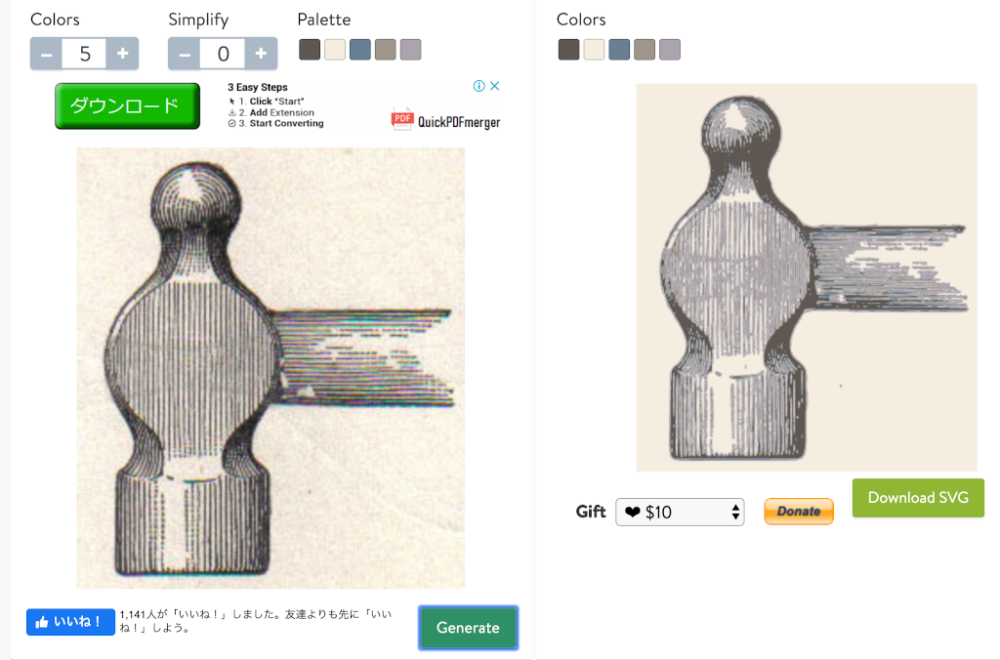
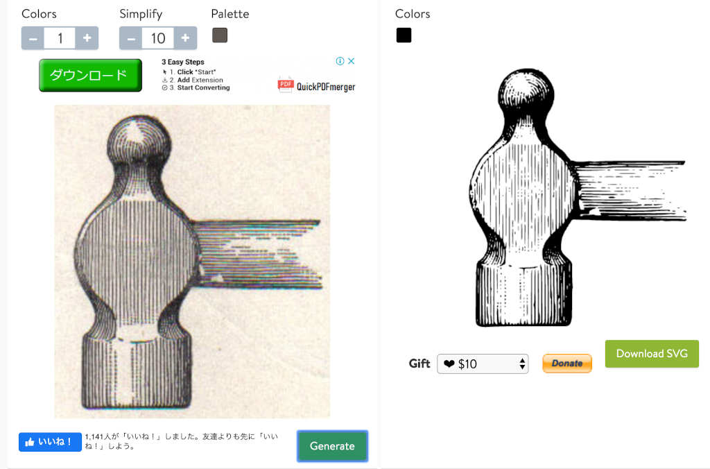
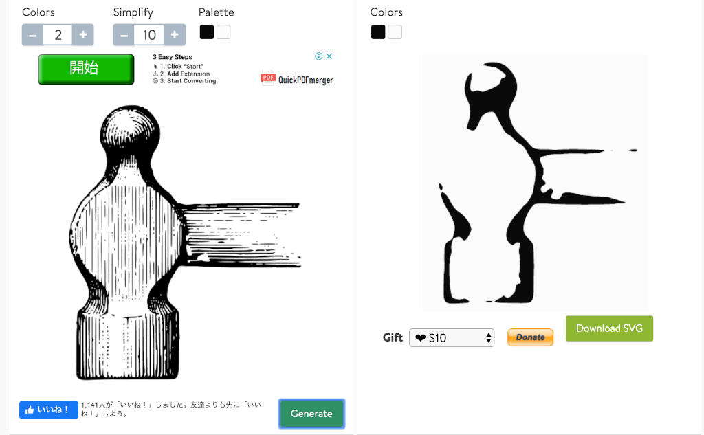

# 絵が描けない私が気の利いたアイコンを作る

Update: 2020-03-01

私はプログラミング言語であればたぶん10個くらい人並みに使えます。HTMLとCSSも普通の仕事では困らないくらいにできます。でも、絵は描けません。
とはいえ最近は便利になったもので、
[Material Design Icons](https://material.io/resources/icons/)
などのよいものが無料で使えるようになっています。有料で何千というアイコンが用意されているサービスもあります。
しかしながらプラウザの左上端とかスマホのホーム画面とかに表示するアプリのアイコンはそれらを使ってというわけにはいきません。
で、どうするか。

## 漢字 １文字を使う

東洋には「漢字」という素晴らしいものがあります。
「戦艦ポチョムキン」等で有名な映画監督セルゲイ・エイゼンシュテインは、
パーツを組み合わせて新しい意味を作る漢字の仕組みを弁証法（ヘーゲルやマルクスの哲学に出てくるアレ）であるとか言ってました。
Wordか何かに漢字 1文字を大きめサイズで書いて、スクリーンショットとして PNG 形式に保存して、必要なら
https://icoconvert.com/
あたりで ICO 形式にも変換すれば十分使えます。

しかしながらフォントにも著作権というものがあります。
日本語の場合、主にモリサワとかリコーとかの製品が使われていますが、
みなさんがそれらの著作権を気にせず利用できるのは
Microsoft社等が自社の製品とセットでばら撒いてくれているからです。
そのフォントを文書作成で普通に使う分には問題ないのですが、
配布の条件として想定されていないそれ以外の方法で利用できるかどうかは個別に調べてみないとよくわかりません。
正直なところ、それを調べるのが面倒です。

その辺を気にしなくていいのは

  * [IPA フォント](https://ipafont.ipa.go.jp/)
  * [Google Noto Fonts](https://www.google.com/get/noto/)

くらいかな。
文字数の少ないアルファベットならフリーのフォントもたくさんあります。

## Wikipedia でフリーの画像を漁る

Wikipedia にはフリーの画像がたくさん掲載されています。
日本語版より英語版で探していただく方がたくさん見つけられていいです。
で、掲載されている画像をクリックすると、こんな感じで著作権についてきちんと記載されています。
この画像の場合 Public Domain ですね。
気に入った画像を見つけたらダウロードします。

次に、アイコン用に細部を切り落とします。まず、紙の風合い。
私の場合、フリーの画像加工ツール [GIMP](https://www.gimp.org/) を使うことが多いのです。
トリミングやポスタリゼーションくらいのために Photoshop を使うのはもったいないですから。
それ以外に https://www.pngtosvg.com/ も使えます。
PNG や JPEG などのビットマップ形式の画像をベクター形式の SVG に変換してくれます。

まず "Drag & Drop a file" と書かれているところに画像を放り込んで、
デフォルトの設定で変換してみましょう。
画像の右下の "Generate" ボタンを押してください。
"Colors" の下の「ダウンロード」ボタンは広告なので変なところに飛んでいきます。

元の画像をかなり忠実に再現してくれています。
次に "Colors" を最小の 1 それから "Simplify" を最大の 10 にして変換します。

白黒の画像になりました。
ベクターデータらしく、輪郭ははっきりしています。
これをダウンロードして Webブラウザなどでできるだけ大きく表示し、スクリーンショットを撮って PNG 形式で保存し、それをまた
https://www.pngtosvg.com/ にアップロードします。
そして、"Colors" を 2 （ここが重要）、 "Simplify" を 3 〜 10 にして変換します。

"Simplify" 3 の場合

"Simplify" 10 の場合

自分の手で描くことは絶対にできない渋いのができました。

Tag: web design
