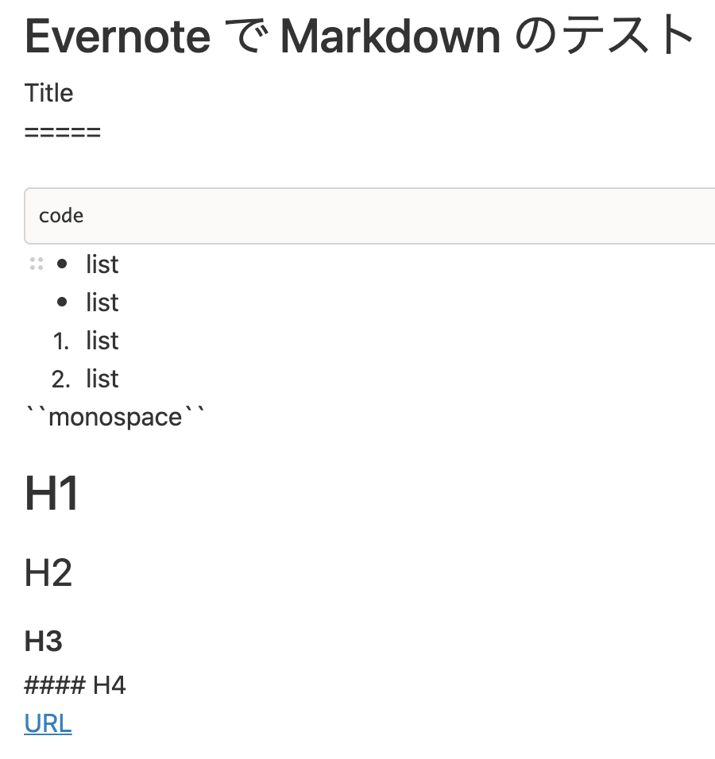

# Evernote で Markdown

Update: 2021-05-05

完全ではないのですが Evernote で Markdown が使えるようになっていました。以前はプログラムコードなどを等幅フォントにしてもイマイチな感じだったのですが、これくらいできてくれると、まあ、いいかな。

```markdown
Title
=====

```
code
```

- list
- list
1. list
2. list

``monospace``

# H1

## H2

### H3

#### H4

[URL](https://michinobu.jp)
```

と入力するとこんな感じに。



Notion ならそれをテキストエディタなどにコピペすると元の Markdown のソースになってくれるのですが、
Evernote はこんな感じ。

```markdown
Title
=====

```
code
```
- list
- list
1. list
2. list
``monospace``
H1

H2

H3

#### H4
URL
```

Tag: markdown evernote
