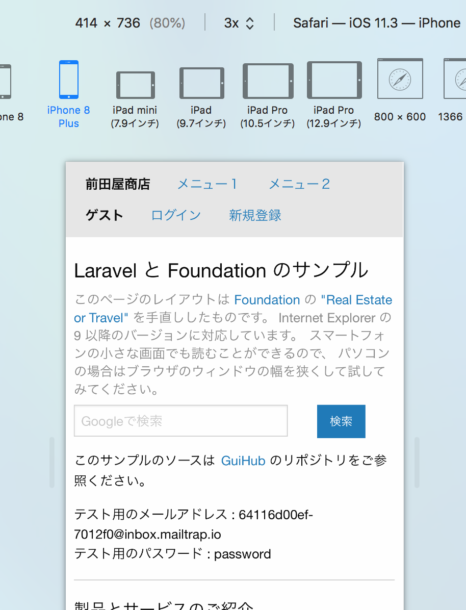

# 共用型レンタルサーバで Laravel その２

Update: 2018-09-22

[共用型レンタルサーバで Laravel](laravelonsharedserver.html) で作ったものをさくらのライトプランに置いてみました。

ssh は使えないので、とにかく全部を ftp でアップロードしただけですが、問題なく動きます。

データ量が少なければ SQLite で十分でしょう。
ただ、DBのマイグレーションの機能が使えないので、
DBのテーブル等の定義を変更する場合は別の手段でどうにかするしかありません。

Tag: PHP Laravel SQLite
