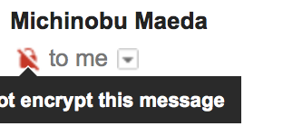

# smtp_tls_security_level

Update: 2017-12-07


久しぶりに立てたメールサーバから Gmail 宛に送信すると、なんだか赤いマークが付いてます ^^;



暗号化されてないからよくないと。。。

昔は当たり前ではなかったSMTPサーバ間の暗号化が求められているのでしょうか？

少し調べてみると、 2009年の Postfix 2.3 で
``smtp_tls_security_level``
というパラメータが追加になっています。
Change log によると、いろいろパラメータがあってごちゃごちゃしてたのを整理したのだそうです。

```
smtp_tls_security_level = may
```

で Gmail さんには文句言われなくなりました。

Tag: SMTP STARTTLS TLS Postfix

