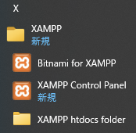

# Windows に WordPress のテスト環境を作る

Update: 2021-04-29


Webサーバで Linux や BSD などを使っていても、開発やテストには Windows を使う人は多いです。
Windows でも [WSL](https://docs.microsoft.com/ja-jp/windows/wsl/install-win10) やその他の仮想マシンの製品を使えば Linux が動くので、基本的にはそちらの方をお勧めします。しかしながら Linux のコマンドを使い慣れていないとか、ハードウェア等の制約で WSL や仮想マシンを使えないといったこともあるでしょう。以下、 WSL や仮想マシンを使わずにできるだけ手間をかけずに Apache と PHP と MySQL をセットアップして WordPress を動かす環境を準備する手順です。

## XAMPP のインストール

Windows に Apache, PHP, MySQL を個別にインストールするのはたいへんなので、
それらをまとめてインストールできる XAMPP という製品を使います。

この後の作業の中でファイアウォールの警告が出たら「アクセスを許可する」を選択してください。

まず <https://www.apachefriends.org/download.html> から "7.4.x / PHP 7.4.x" をダウンロードします。

ダウンロードした ``xampp-windows-x64-7.x.x-n-VC15-installer.exe`` を実行します。インストールする機能のうち FTP Server, Mail Server, Tomcat, Webalizer は不要です。
Perl も不要かもしれません。


インストールが終わると Windows のスタートメニューに以下のような項目が追加されます。



Apache と MySQL は "XAMPP Control Panel" から起動します。Windows のデフォルトの設定では HTTP のポート 80 がファイアウォールで拒否されています。この設定は変えない方がいいので、
Apache のポートの方を変えます。まず、設定ファイルの編集のために ``C:\xampp`` フォルダにユーザのフルコントロール権限を追加してください。

    - ``C:\xampp`` フォルダをマウスで右クリックする。
    - 「xammppのプロパティ」の「セキュリティ」を選択する。
    - 「編集...」ボタンを押す。
    - 「Users」を選択して「フルコントロール」の「許可」にチェックを入れる。
    - 「OK」ボタンを押して閉じる。

"XAMPP Control Panel" の Apache の Config ボタンを押して Apache (httpd.conf) を選択し、

```
Listen 80
```

を

```
Listen 8080
```

に変更してください。
``8080`` でなくても ``8000`` とか ``8888`` でもいいです。

Apache の Start ボタンを押します。エラー無しで起動したらブラウザで http://localhost:8080/ を開いてください。 "Welcome to XAMPP for Windows 7.4.x" が表示されたらOKです。

次に "XAMPP Control Panel" で MySQL の Start ボタンを押してください。エラー無しで起動したらブラウザで http://localhost:8080/phpmyadmin/ を開いてください。 phpMyAdmin が表示されたら OK です。

## WordPress のインストール

phpMyAdmin で「ユーザアカウント」を選択し、「ユーザアカウントを追加する」リンクをクリックします。「ユーザ名」、「パスワード」、「再入力」を記入し、「同名のデータベースを作成してすべての権限を与える。」にチェックを入れ、「実行」ボタンを押します。これらのデータベース名、ユーザ名、パスワードを WordPress で使います。

<https://ja.wordpress.org/download/> の「WordPress 5.x.x をダウンロード」ボタンを押し、ダウンロードした wordpress-5.x.x-ja.zip を解凍して ''C:\xampp\htdocs'' の下に移動してください。今回は ''C:\xampp\htdocs\wordpress'' とします。

ブラウザで http://localhost:8080/wordpress/ を開くと、インストーラが表示されます。インストーラの指示に従い、「データベース名」、「ユーザー名」、「パスワード」を入力します。「データベースのホスト名」はデフォルトの "localhost" 、「テーブル接頭辞」はデフォルトの "wp_" のままでいいです。表示された指示に従ってインストーラの残りの手順も実行します。最後に WordPress にログインし、管理機能が表示できれば OK です。

再度ブラウザで http://localhost:8080/wordpress/ を開くと、今度はインストーラではなく WordPress のコンテンツが表示されます。サンプルの投稿記事が表示されていたら OK です。

## サーバの停止

Apache と MySQL は "XAMPP Control Panel" の Stop ボタンで停止してください。

Tag: Windows Apache MySQL WordPress


