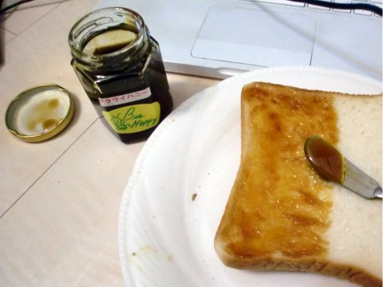

マラウイ産ハチミツ
=====

Update: 2010-03-14

通販でアフリカのマラウイ産のハチミツを買いました。

マラウイは、１人あたりGDPが23,000円という最貧国で、農薬など買えないのでまちがいなく安全です。しかも、アフリカミツバチ自体はとても凶暴で人の手による養蜂はできません。そういうわけで必然的に天然です。

このワイルドなハチミツ、主にマンゴーやナッツの蜜で、めっちゃ濃いです。褐色、というか、瓶に入っていると焦げ茶色くらいで、なんというか、本当にアフリカな感じです。
私はアマゾンで買いました。

取り扱いは http://www.malawi.jp です。フェアトレードのことなど詳しいことについてはWebサイトの説明を見ていただければいいと思います。

ちなみに国産のハチミツでも、近年復活した日本ミツバチは農薬などにたいして敏感なので安全なのだそうです。銀座のどこかのビルの屋上で飼育している話がニュースになったのでご存じの人もいらっしゃるかもしれません。
