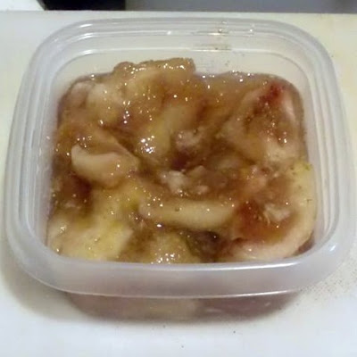

いちじくジャム
=====

Update: 2010-09-12

イチジクでジャムを作りました。昔、母が、実家の裏庭のイチジクで作ったジャム、少し焦げたにおいがしていたと思っていたけど、自分で作ってみたらそうじゃなくて、本来の香りなのだとわかりました。

作り方：

イチジクの皮を可能か限り剥いて（全部は無理）、1/4くらいに切って鍋に入れます。イチジクの1/3〜1/2くらいの量の砂糖を入れます。水は、イチジクがギリギリ水没してしまわない程度。焦げないように超弱火で飴色にになるまで煮ます。

ガスコンロ等で火力の調整が難しい場合は適宜かき混ぜてください。
