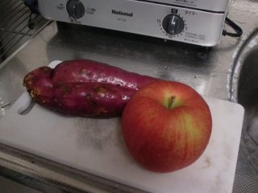
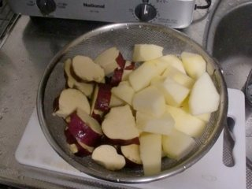
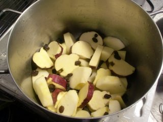
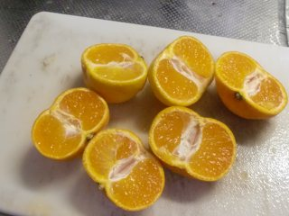
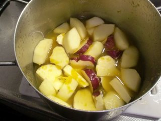
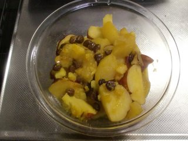

サツマイモとリンゴのオレンジジュース煮
=====

Update: 2011-11-03

Facebook で [Yukari](https://www.facebook.com/yukari.rich) さんに教えてもらったのですが、材料はお聞きしたものの手順は自己流なので、何か違うものができているかもしれません。

愛媛の実家の家庭菜園で採れたサツマイモと、青森旅行した母から送られてきたリンゴです。

一口大に刻みます。

鍋に入れます。レーズンをぱらぱらと。

愛媛のみかん、小さなものを10個ほど絞ります。

ジュースは濾したりしていないので、渋皮も入ってます。少し水を足し、蓋をして、火が通るまでできるだけ弱火で。

蓋をとって煮詰めてできあがり。子どもの頃、みかんをストーブで焼いてみたときの香りがします。
