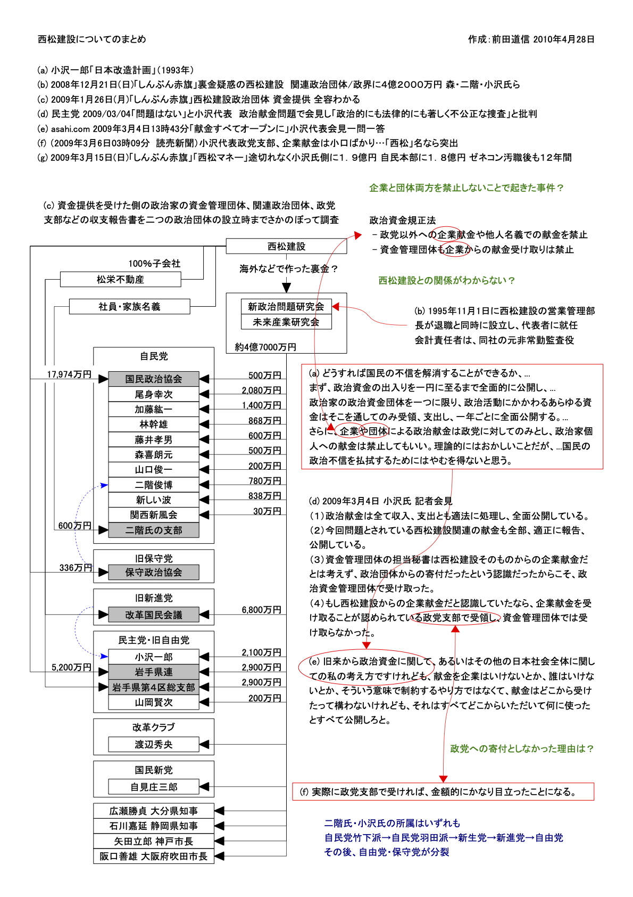

西松建設についてのまとめ
=====

Update: 2010-04-28

小沢氏の事件について整理しようと思って資料を見始めたのですが、なぜか古い（ってほどでもないか）事件の方が気になってしまってまとめてみました。

『(a) 小沢一郎「日本改造計画」（1993年）』以外の各資料の参照元URLは次の通りです。

(b) 2008年12月21日(日)「しんぶん赤旗」裏金疑惑の西松建設　関連政治団体/政界に４億２０００万円 森・二階・小沢氏ら
http://www.jcp.or.jp/akahata/aik07/2008-12-21/2008122115_01_0.html

(c) 2009年1月26日(月)「しんぶん赤旗」西松建設政治団体 資金提供 全容わかる
http://www.jcp.or.jp/akahata/aik07/2009-01-26/2009012615_01_0.html

(d) 民主党 2009/03/04「問題はない」と小沢代表　政治献金問題で会見し「政治的にも法律的にも著しく不公正な捜査」と批判
http://www.dpj.or.jp/news/?num=15370

(e) asahi.com 2009年3月4日13時43分「献金すべてオープンに」小沢代表会見一問一答
http://www.asahi.com/special/09002/TKY200903040136.html

(f) （2009年3月6日03時09分 読売新聞）小沢代表政党支部、企業献金は小口ばかり...「西松」名なら突出
http://www.yomiuri.co.jp/feature/20090304-527751/news/20090306-OYT1T00048.htm

(g) 2009年3月15日(日)「しんぶん赤旗」「西松マネー」途切れなく小沢氏側に１．９億円 自民本部に１．８億円 ゼネコン汚職後も１２年間
http://www.jcp.or.jp/akahata/aik07/2009-03-15/2009031501_01_0.html

ついでに一言：企業からの献金は政党に対してだけOKっつーことだが、選挙区単位の政党支部に献金したらほとんど政治家個人への献金と変わらんだろ。そこで選挙だとかするんだから
