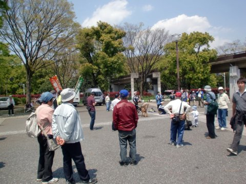
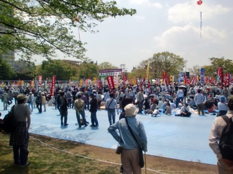
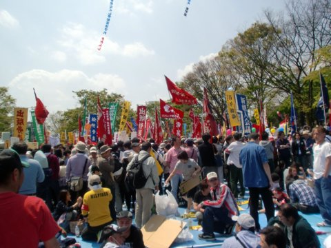
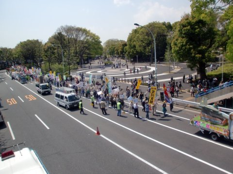

第81回中央メーデー
=====

Update: 2010-05-01

報道では「全労連のメーデー」となっていますが、参加組合は全労連だけではありません。私が所属する電算労が加盟するマスコミ文化情報労組会議のほとんどの組合は全労連未加盟です。

会場の外では荒馬座が出張で太鼓たたいてました。

会場内全景

電算労の旗が見えるのですが（写真の真ん中）人が多くて近づけません。
左側は出版労連、右側は演劇関係のようです。
松竹、前進座、劇団民芸、青年劇場などの旗が見えます。

あきらめて会場の外に出ました。焼きそばを食べながら引き続き荒馬座を鑑賞。
原宿駅に歩いて行くとちょうど東京土建が明治公園方面に出発したところです。

今年の参加者は3万2千人だそうです。
