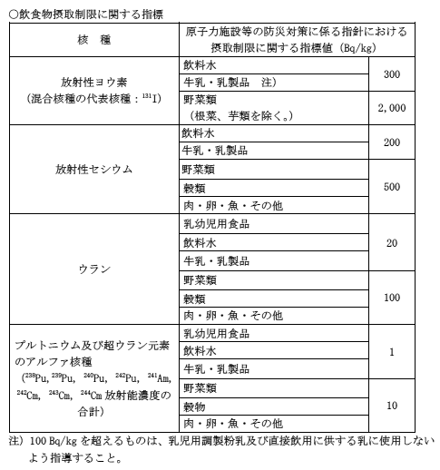

シーベルトとかベクレルとか
=====

Update: 2011-03-21

まず最初に、私は文系です。高校で物理部みたいなところにいたり、今、システムエンジニアみたいな名前の仕事をしていたりしますが、それは仮の姿です。ま、四則演算ができればほとんどのプログラミングの仕事で困ることはありません。

このところメディアで氾濫している放射線・放射能関係の単位について調べてみました。

その前に、基本的なことを。アルファ線とかベータ線とかの "放射線" を出す能力が "放射能" で、 "放射能" を持つ物質が "放射性物質" です。

それから、どの単位にも "ミリ" とか "マイクロ" とか付いていますが、

- ミリが付く単位は何も付かない単位の 1,000 分の 1
- マイクロが付く単位は何も付かない単位の 1,000,000 分の 1
- ナノが付く単位は何も付かない単位の 1,000,000,000 分の 1
- ミリはマイクロの 1,000倍 マイクロはミリの 1,000 分の 1
- マイクロはナノの 1,000倍 ナノはマイクロの 1,000 分の 1

となります。

もう一つ、それぞれの単位を時間で割り算した単位がよく出てきます。 "/h" （毎時）などです。毎時と年間、さらに時間は関係なく１回当たり、とか、累積とかがごちゃごちゃに入っている記事もめずらしくありません。時間の単位は10進法ではないので、計算が面倒です。
1時間は 3,600秒
1日は 24時間で、 86,400秒
1年を 365日とすると 8,760時間で、 3,153,600秒
となります。

## 放射線の単位

資料：放射線影響研究所用語集
http://www.rerf.or.jp/glossary/index.html

### グレイ ( Gy )

おおざっぱに言うと、放射線が物質にぶち当たったとき、その物質に及ぼすエネルギーです。単位質量あたりのエネルギーというのが「？」です。光の強さとか水圧とかなら単位面積あたりになるでしょう。少し考えてみたのですが、放射線は物質を通過するので、物質にぶち当たったところで止まってしまう光とか水圧とかとは違って、面ではなく空間で考えなければならないようです。

普通の人は、年間平均 2ミリグレイほどの放射線を浴びているそうです。
毎時だと 0.228マイクログレイになります。

### シーベルト ( Sv )

放射線の種類によって、同じエネルギー（つまりグレイで表される強さ）でも、人体に与える影響が異なります。その違いを考慮してならした単位がシーベルトです。放射線被曝者医療国際協力推進協議会 放射線の基礎知識 http://www.hicare.jp/09/hi03.html によると、「JCOの事故のように特殊な例を除いて、通常の被曝はX線、線が主ですのでGy=Svと扱ってかまわないことになります。」とのことです。

以下、東京電力 日常生活と放射線 http://www.tepco.co.jp/nu/knowledge/radiation/radia1-j.html からの抜き書きです。

> 集団検診で胸のX線 ( 1回 ) 
> 0.05 ミリシーベルト ( 50 マイクロシーベルト )
>
> 東京〜ニューヨークを飛行機で往復 
> 0.19 ミリシーベルト ( 190 マイクロシーベルト )
>
> 集団検診で胃のX線 ( 1回 ) 
> 0.6 ミリシーベルト ( 600 マイクロシーベルト )
>
> １人当たりの自然放射線 ( 年間 ) 
> 2.4 ミリシーベルト ( 2,400 マイクロシーベルト )
> 時間当たりなら 0.273 マイクロシーベルト
>
> ブラジルのガラバリの場合 ( 年間 ) 
> 10 ミリシーベルト ( 10,000 マイクロシーベルト ) 日本？世界？の平均の 4倍 
> 時間当たりなら 1.141 マイクロシーベルト

### ひたちなか、水戸などの測定結果の場合

茨城県環境放射線監視センターが 10分毎の測定結果を公開しています。
http://www.houshasen-pref-ibaraki.jp/present/result01.html

"2011年03月21日19時10分の状況" の場合、観測地点によって大きな差があります。

最小 : 常陸太田市久米 : 毎時 147ナノグレイ ( 毎時 0.147 マイクログレイ )

1 グレイ = 1 シーベルトと仮定すると、東京電力の資料の "１人当たりの自然放射線 ( 年間 ) " を時間単位に割り算したものより少ないようです。

最大 : 鉾田市樅山 : 毎時 1,139 ナノシーグレイ ( 毎時 1.139 マイクログレイ )

1 グレイ = 1 シーベルトと仮定すると、東京電力の資料の "ブラジルのガラバリの場合 ( 年間 )" くらいです。

鉾田市樅山の 2011年03月20日20時頃以降のグラフを見ると、2011年03月21日で一番多かったのは午前 5時台で、だいたい平均で毎時 2,500 ナノグレイ ( 毎時 2.5 マイクログレイ )  です。

1 グレイ = 1 シーベルトと仮定すると、 "放射線業務従事者の線量当量限度 ( 年間 )" を時間単位に割り算した、毎時 5.7 マイクロシーベルトの 44% くらい。

外部被曝については、私が計算間違いしていなければ、こんなところです。

スウェーデン国立スペース物理研究所 山内正敏氏の記事 "放射能漏れに対する個人対策" http://www.irf.se/~yamau/jpn/1103-radiation.html で「安心して良い」としている値が「普通の人で10マイクロSv/時、妊娠初期の人で3マイクロSv/時」なのですが、その範囲には収まっているようです。

### 柏崎と東京の測定結果の場合

東京電力 環境放射線データの公開 http://www.tepco.co.jp/nu/pamp/index-j.html の 2011年03月21日9時50分の値は、電力館(東京) 67nGy/h 、柏崎刈羽原子力発電所 45nGy/h だったのですが、まあ、日常の値、もしくは、それより少し高い値ということで、そんなものでしょう。

### 福島第一原発の現場

東京電力 日常生活と放射線 http://www.tepco.co.jp/nu/knowledge/radiation/radia1-j.html からの抜き書きの続きです。

> 放射線業務従事者の線量当量限度 ( 年間 ) 
> 50 ミリシーベルト ( 50,000 マイクロシーベルト ) 
> 時間当たりなら 5.7 マイクロシーベルト
>
> 全身被曝 これより低い線量では臨床症状が確認されていません 
> 100 ミリシーベルト ( 100,000 マイクロシーベルト )
>
> 全身被曝 白血球の一時的減少 
> 500 ミリシーベルト ( 500,000 マイクロシーベルト )

「全身被曝」の単位は、時間で割り算していません。いっぺんにこれだけ放射線を浴びたらどうなるか、という話になります。報道記事には「従来の制限値（100ミリシーベルト）」のような記述が見られます。事故発生後 、制限値が 250ミリシーベルトに引き上げられているようです。

## 放射能の単位

資料：東京電力 放射線と放射能
http://www.tepco.co.jp/nu/knowledge/radiation/index-j.html

### ベクレル ( Bq )

1秒間に 1個の原子核が崩壊するのが 1Bq って言われてもなぁ...

この単位が使われているのは、報道記事で「暫定基準」と記されている「原子力施設等の防災対策に係る指針における摂取制限に関する指標値」です。

食安発0317第3号 平成23年3月17日 
厚生労働省医薬食品局食品安全部長 
放射能汚染された食品の取り扱いについて
http://www.mhlw.go.jp/stf/houdou/2r9852000001558e-img/2r9852000001559v.pdf

今まで決まってなかったということ。。。だよね？

