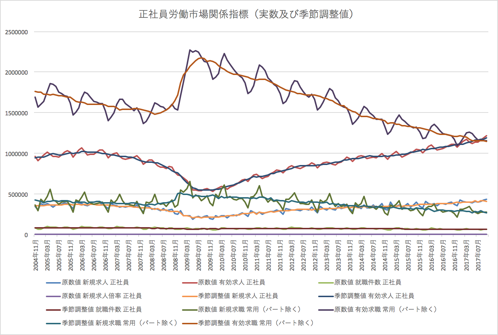
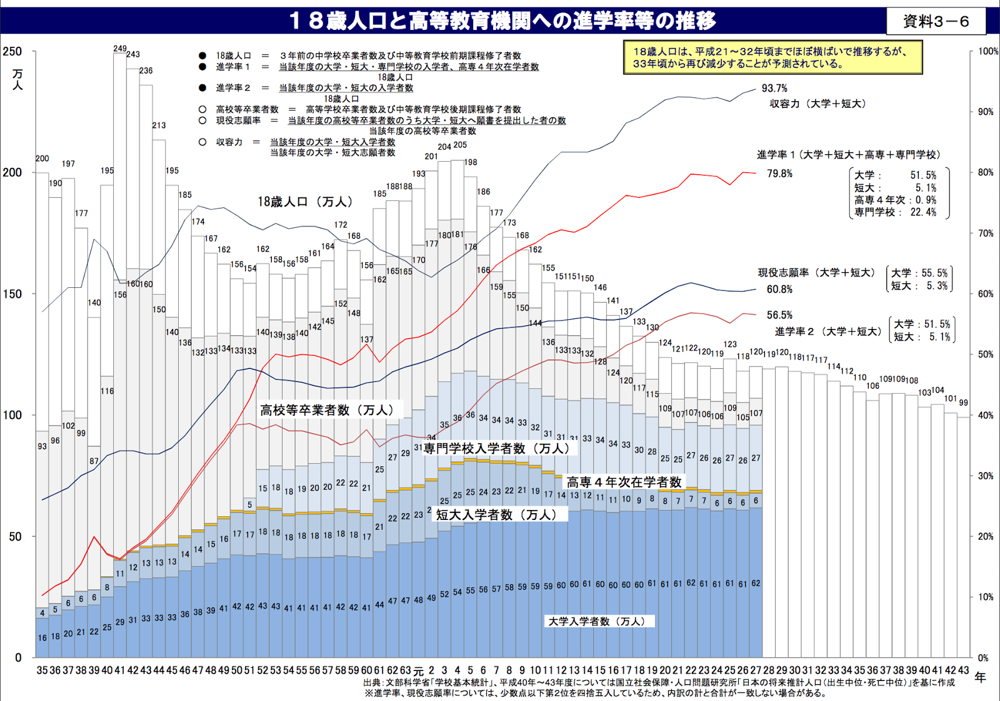

18歳人口は25年前の３分の２
=====

Update: 2017-12-10

2017年6月の正社員求人倍率が、調査を始めた2004年以来初めて 1.01倍を超えたそうです。もしかして、バブル崩壊の1991年以来でしょうか。それはいいのですが、気になるのは、日経の記事に載っていたグラフです。リーマンショクの2008年に 0.25倍まで落ちた後、一直線に増えています。これ、政策はあまり関係ないだろ ^^;

[正社員の求人倍率 初の1倍超え 6月1.01倍 日経新聞 2017年7月28日 9:34](https://r.nikkei.com/article/DGXLASDF28H03_Y7A720C1MM0000)

求人は増えているだろうけど、求職は減ってるよね？ と、政府の統計
[一般職業紹介状況 長期時系列表](http://www.e-stat.go.jp/SG1/estat/NewList.do?tid=000001020327)
[月次 2017年10月](http://www.e-stat.go.jp/SG1/estat/List.do?lid=000001197883)
からグラフを作ってみたのがこちら。

正社員求人（上から2番目の線）は一直線に増えてリーマンショック前を上回っていますが、正社員求職（一番上の線）も一直線に減っていて、リーマンショック前を下回りました。当然のことながら、求職が増えていたら正社員求人倍率はまだ 1倍超えていません。

人口の推移はどうかというと、全世代の動態をいっぺんに見るとわけわかんないので18歳で見てみることにします。

http://www.mext.go.jp/b_menu/shingi/chousa/koutou/069/gijiroku/__icsFiles/afieldfile/2016/06/08/1371868_7.pdf

18歳人口は、25年前の３分の２ですね。ただし、2008年（平成20年）あたりから現在まではあまり変わりません。正社員求職が減っているのは上の世代が減っているからでしょうか。

人口の推移が大きく変わらなければ（変わりません、これまでの出産数で既に決まっています）、この先、就職する人の数は減ることはあっても増えることはなさそうです。求職が増えても応えられません。変えられるとしたら、女性と外国人、それから、ミスマッチを減らす教育です。

別の話ですけれど、大学への入学者の学力が落ちているのは、大学の定員が減らないのに高校卒業者の数が減ってるのだから当たり前、高校までの教育が悪いわけではないというのを聞いたことがあるのですが、本当ですね。
