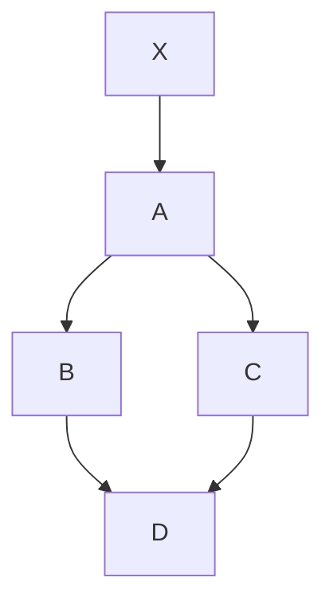

# ページの見出し

Update: 2023-02-04

## 見出しレベル２

あいうえおかきくけこアイウエオカキクケコ０１２３４５６７８９0123456789〇一二三四五六七八九
あいうえおかきくけこアイウエオカキクケコ０１２３４５６７８９0123456789〇一二三四五六七八九
あいうえおかきくけこアイウエオカキクケコ０１２３４５６７８９0123456789〇一二三四五六七八九

あいうえおかきくけこアイウエオカキクケコ０１２３４５６７８９0123456789〇一二三四五六七八九
あいうえおかきくけこアイウエオカキクケコ０１２３４５６７８９0123456789〇一二三四五六七八九

### 見出しレベル３

The quick brown fox jumps over the lazy dog.
The quick brown fox jumps over the lazy dog.
The quick brown fox jumps over the lazy dog.

The quick brown fox jumps over the lazy dog.
The quick brown fox jumps over the lazy dog.

```python
import os
import re
import markdown
from mdx_gfm import PartialGithubFlavoredMarkdownExtension

def render_markdown(md):
    return markdown.markdown(
        md,
        extensions=[PartialGithubFlavoredMarkdownExtension()]
    ).replace(
        'class="language-mermaid"',
        'class="mermaid nohighlight"'
    )
```

#### 見出しレベル４

- 番号無しリスト
- 番号無しリスト
    - 番号無しリスト
    - 番号無しリスト
    - 番号無しリスト
- 番号無しリスト

1. 番号付きリスト
2. 番号付きリスト
    - 番号無しリスト
    - 番号無しリスト
    - 番号無しリスト
3. 番号付きリスト

##### 見出しレベル５

GitHub Flavored Markdown

| First Header  | Second Header |
| ------------- | ------------- |
| Content Cell  | Content Cell  |
| Content Cell  | Content Cell  |

###### Mermaid



###### MathJax

When $a \ne 0$, there are two solutions to $(ax^2 + bx + c = 0)$ and they are
$$ x = {-b \pm \sqrt{b^2-4ac} \over 2a} $$

Tag: markdown tailwind
