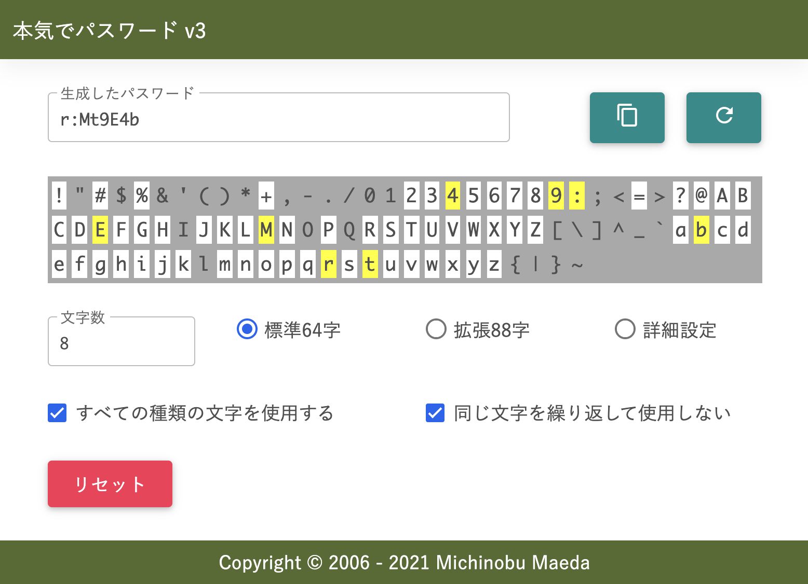

本気でパスワード v3
======

Update: 2021-05-26

ランダムなパスワードを生成します。

v3 で文字種のお任せ指定をできるようにしました。通常の用途でしたらデフォルトの設定のままでたいていだいじょうぶです。

- 設置場所: [https://michinobu.jp/honkipass](https://michinobu.jp/honkipass)
- ソース: [https://github.com/MichinobuMaeda/honkipass](https://github.com/MichinobuMaeda/honkipass)
- ZIP: [https://github.com/MichinobuMaeda/honkipass/archive/refs/heads/main.zip](https://github.com/MichinobuMaeda/honkipass/archive/refs/heads/main.zip)

たまにパスワードで使用できる文字種の制約が厳しいサイトがありますね。その場合は条件に合う物が出るまで繰り返して生成するか、「詳細設定」で「使用しない文字」に条件に合わない文字を追加していただくかどちらかでお願いします。

~~UIのフレームワークには [Materialize](https://materializecss.com/) を使いました。コンポーネント等は少ないですが、簡単でいいです。~~

UIのフレームワークには [MDB: Material Design for Bootstrap](https://mdbootstrap.com/) を使いました。使いやすいです。ただ、テキストフィールドが Outline だけです。ベースが Bootstrap だからでしょうか。アイコンは [Font Awesome](https://fontawesome.com/) ではなく [Material Icons](https://fonts.google.com/icons) を使いました。

Google の [Material Components for the web](https://github.com/material-components/material-components-web) はテキストフィールド１個だけでもたいへんです。

Tag: javascript material
