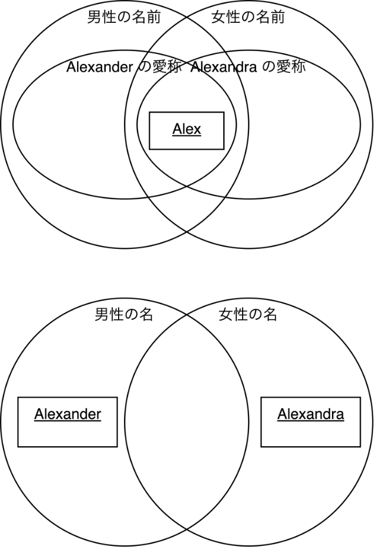
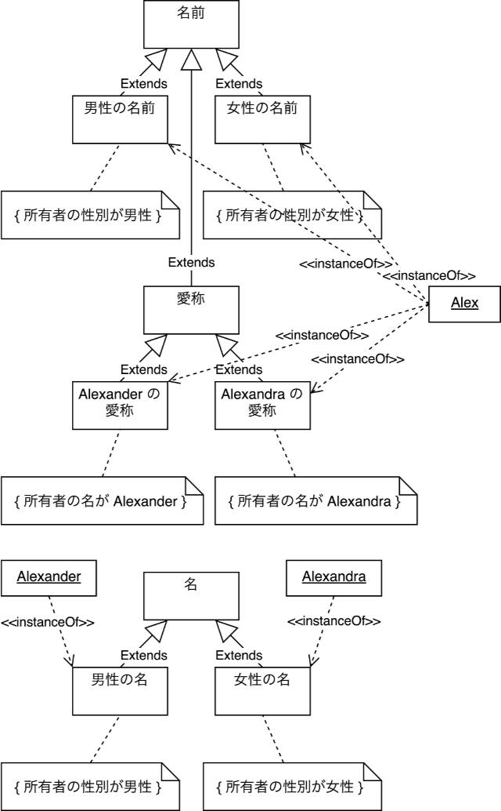

# 国語の問題文を分析してみる

Update: 2021-07-10

「AI vs. 教科書が読めない子どもたち」新井 紀子 ISBN：978-4-492-76239-4
に次の問題の、中学生の正答率が 38% だったという話が載っています。最近 SNS で少し話題になっていたので買って読んでみました。

> Alex は男性にも女性にも使われる名前で、女性の名 Alexandra の愛称であるが、男性の名 Alexander の愛称でもある。

という文章を読んで、

> Alexandraの愛称は（ ）である。

の ( ) に入るものを

1. Alex
2. Alexander
3. 男性
4. 女性

から選ぶという問題です。

確かに少々回答に迷ってしまう問題です。
SNS 上では文章の中の単語の意味に着目した意見が出ていました。でも、単語の意味が分からなくても解くことができなくはない問題のように思えます。引用元の本の他のところでも、コンピュータは人間のように意味を理解しているのかどうかについて論じています。「男性」、「女性」、「名前」のようなキーワードの意味がわからなくても正解を選択することが可能なのかどうか、考えていました。

なお、念のため、以下の内容は、引用元の本の内容とは関係ありません。
AI 技術がこんなことをしているというわけではありません。たぶん。知らんけど。

まず、問題の文章を私なりに分解してみます。

1. Alex は男性に使われる名前である。
2. Alex は女性に使われる名前である。
3. Alexandra は女性の名である。
4. Alexander は男性の名である。
5. Alex は Alexandra の愛称である。
6. Alex は Alexander の愛称である。

この中に正解がありますよね。

では、次に、キーワードを全て

- A: Alex
- B: Alexandra
- C: Alexander
- D: 男性
- E: 女性
- F: 名前
- G: 名
- H: 愛称

という形で記号に置き換えてみます。

「名前」と「名」が違うの？ と思われた人は、このページの後半を見てください。この問題の文章では違う意味の単語として使われています。この文章の中で「名前」と「名」はシノニムではないし、また、混乱した状態で使われているわけでもありません。

それから、「に使われる」は単に「の」に置き換えても十分に意味が通じますので、それも置き換えてしまいます。

1. A は D の F である。
2. A は E の F である。
3. B は E の G である。
4. C は D の G である。
5. A は B の H である。
6. A は C の H である。

さらにこの場で私がてきとーに作った文法でプログラムっぽくしてみます。

1. A is a F for D
2. A is a F for E
3. B is a G for E
4. C is a G for D
5. A is a H for B
6. A is a H for C

で、「 x is a H for B 」の x は何かと聞かれると、答えは一つしかありません。

単語の意味（例えば一番難しそうな「愛称」）がわからなくて解けない人は確かにいるわけですけれど、それは単語の意味がわからないから解けないのではなくて、むしろ意味にを理解しようとすることにじゃまされて解けないというようなこともありそうな気がします。

ただ、その前に、文章の構造を把握することができず、キーワードを追っかけるような読み方をしてしまう人、文章を書くと構造がはっきりしないキーワードが並んでいるだけのようものになってしまう人の場合は、一つでも意味のわからない単語があると、この問題を解くことができないか、ずいぶん苦労するかでしょう。

次に、もう少しきちんとオブジェクト指向で分析してみます。まず `is a` ですが、

> X is a Y

は 「 X はクラス Y のインスタンスである」ということで良さそうです。しかし `for` はダメです。プログラムの条件文の中で使う演算子に `for` みたいなものはたぶんありません。たいていのプログラミング言語で `for` は処理構造を表すものです。なにかうまく表現できていません。そこでまた意味に戻って考えてみます。

上記の「 F for D 」は「男性の名前」です。まず、「名前」は明らかにクラスです。ここで使われれている意味としては、人やものを識別することに使われる名詞、というような意味になります。それに対して「男性の名前」は、「名前」のうち、男性（おそらく暗黙的に人間の男性、もしくは擬人化された動物のオスなど）に使われるもの、ということになります。つまり、「男性の名前」は「名前」のサブクラスです。ということは、私がなんとなく `for` と書いたものは、「条件を与えてサブクラスにする」という操作になるようです。他もそうなっているかどうか見てみます。

- 「女性の名前」は「名前」のサブクラス
- 「女性の名」は「名」のサブクラス
- 「男性の名」は「名」のサブクラス
- 「Alexandra の愛称」は「愛称」のサブクラス
- 「Alexander の愛称」は「愛称」のサブクラス

問題なさそう。ただ、「条件を与えてサブクラスにする」という操作を表す演算子のようなものは見たことないな。 UML では制約 ( Constraint ) なんですが。

1. A is intance of (F constrainted by (F is an attibute of D))
2. A is intance of (F constrainted by (F is an attibute of E))
3. B is intance of (G constrainted by (G is an attibute of E))
4. C is intance of (G constrainted by (G is an attibute of D))
5. A is intance of (H constrainted by (H is an attibute of B))
6. A is intance of (H constrainted by (H is an attibute of C))

みたいな感じかな。

まず、ざっくりとした関係を整理するためにベン図を描いてみます。

「名前」と「愛称」の関係は問題文には明示されていないのですが、「愛称」は「名前」のうち用途を限定したものだという制約があると判断できますので、「愛称」は「名前」のサブクラスとしました。

「名」はおそらく「姓」と「名」の「名」、つまり First name だろうと思われます。その場合、「名前」のサブクラスになりそうです。しかし、これは問題の文章からは読み取ることができません。

UML のクラス図を描いてみます。コメントの `{ }` は制約 ( Constraint ) です。

ずいぶん複雑になったな。この問題の文章はたしかに難しいです。とはいえ、このように形式的に表現できるのであれば、キーワードの意味がわからなくても解くことができる問題だということになると思います。

例えば上記の「名」の正確な意味は私にはわからないままでしたが、この問題を解くことには全く影響ありません。「愛称」も、例えば "William" が "Bill" になるというような英語圏の Nickname は日本人にはなんだかよくわからないものですよね。

Tag: uml
