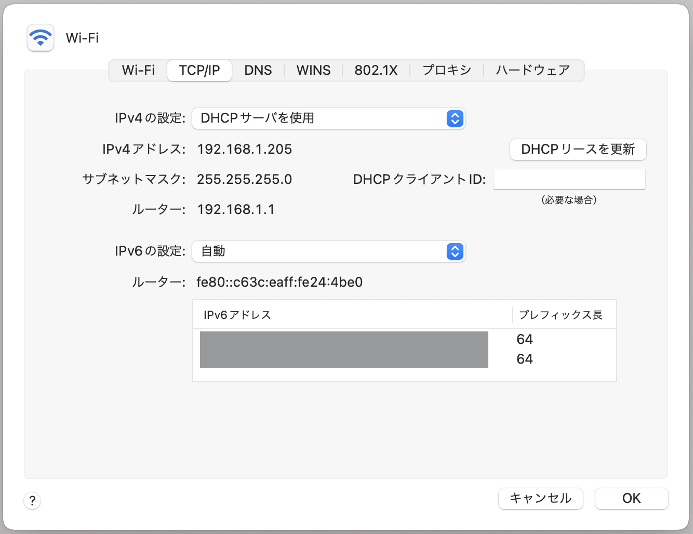

# MacBook が Wi-Fi にうまくつながらないとき

Update: 2022-10-23

私の MacBook Air がコーヒー屋さんの Wi-Fi にうまくつながらないことがあります。
Wi-Fi の接続の表示はだいじょうぶなのに、
Webブラウザで何か表示しようとするとだめです。どうも
DHCP で IPアドレスが取得できていないような、、、

というわけでターミナルを開いて「前にもやったことあるけど、コマンドはなんだったっけ？
Mac　のこのへんのコマンドってときどき変わってしまうんだよな。」とぐぐってみます。ぐぐってみると、ターミナルは開かなくていいです。コマンドは覚えてなくていいです。マウスで数回クリックするだけです。

画面の右上の Wi-Fi　のマークか、「システム環境設定」のどちらかからネットワークの環境設定を開いて、左側にいろいろ並んでいる中から
Wi-Fi を選択して、右下の「詳細...」ボタンを押します。次に「TCP/IP」を選択して「DHCPリースを更新」ボタンを押します。

MacBook を再起動すればよいという記事も見かけたのですが、再起動してもだめな場合がありました。ターミナルからでないとはいえ、ネットワークの知識がない人にこれはわからないよな。。。

で、これ、次の Mac　OS　のアップデートで変わったりしないよね？

Tag: macos
