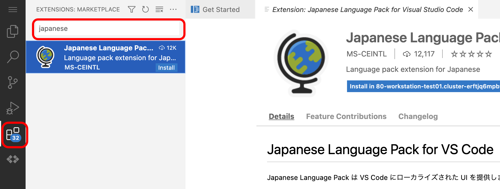

# Firebase, Flutter, Google Cloud Workstations

Update: 2022-11-26

[コンピュータ・ユニオン関西IT支部](https://cu-kansai-it.org/) IT技術者・クリエイターカフェ 2022年11月 資料

このページの URL は <https://pages.michinobu.jp/t/20221126firebasefluttercloudworkstations.html> です。
[GitHub Pages で作成](https://pages.michinobu.jp/t/githubpagesminimal.html)しました。

時間の制約により
[Docker](https://www.docker.com/),
[Git](https://git-scm.com/),
[Node.js](https://nodejs.org/),
[Material Design](https://m3.material.io/),
[VS Code](https://code.visualstudio.com/)
などの説明は省きます。

## A. 概要

### Firebase

<https://firebase.google.com/>

GCP: Google Cloud Platform のサービスで、以下のようなものがセットになった Serverless のシステム基盤です。

- Authentication: 認証基盤
- Firestore: トランザクションをサポートした NoSQL のデータベース
- Cloud Storage: 画像や文書などのファイルを格納するストレージ
- Cloud Functions: 単発の処理の実行環境（プロセスの常駐は不可で処理時間の制限有り）
- Hosting: 静的なファイルだけを置くことができる Webサーバ
- その他、メッセージ配信、メール送信（メールサーバは別途必要）、アクセス解析など

Firestore と Cloud Storage は Authentication と組み合わせたアクセス制御が可能です。
Firestore はデータの内容に基づく動的な制御が可能で、アカウントやアカウントの権限・グループ等に紐付ける形で、読み書きそれぞれのアクセス権を定義できます。

Firestore の RDB との違いは、

- スキーマの定義が不要
- 更新データのプッシュ配信が可能

で、チャットなどのアプリが容易に構築できます。

### Flutter

<https://flutter.dev/>

Google が作ったモバイルアプリ用のフレームワークです。
JavaScript に似た Dart という言語を使います。 JavaScript と違って型の定義が必要なので Java にも似ています。
Flutter は一つのコードから以下の OS向けの実行モジュールを生成できます。

- Android
- iOS/iPadOS
- Web ( SPA: Single-Page Application / PWA: Progressiv Web Apps )
- Windows
- Mac OS
- Linux

見た目の雰囲気は、以下のどちらかを選択できます。

- Material ( Android 風 )
- Cupertino ( iOS 風 )

Flutter は OS やブラウザの UI部品を使わず、すべて自前で描画するので、
異なる OS でもほとんど同じ見た目になります。

サンプル: <https://pages.michinobu.jp/honkipass/>

#### 参考: React Native との違い

Facebook ( Meta ) の React Native は OS の UI部品を使います。
対応する OS は Android と iOS/iPadOS だけで、デスクトップ OS には対応していません。
Web向けの React とロジックは共有できますが、プレゼンテーション層は完全には共有できないようです。

### Google Cloud Workstations

<https://cloud.google.com/workstations>

クラウド上の開発環境で、 Debian Linux の仮想マシンと Web版エディタなどがセットになっています。
Visual Studio Code とほぼ同じ仕様の Code OSS が Web上で利用できます。

- 非力なPCやChromebookで開発したい場合
- 短期間の開発の場合
- 自分のPCで複数のバージョンの言語やライブラリを管理するのが煩わしい場合
- 開発環境を Docker のコンテナとして配布したい場合

後述する gcloud CLI が不要であれば iPad や Android タブレットでも利用可能かもしれません。

## B. 環境の準備

以下の順番で環境を作成します。

1. GCP のアカウントの作成（無い場合）
2. Firebase プロジェクトの作成（他人と重複しないプロジェクト名が必要）
3. gcloud CLI のインストール
4. Workstation の作成
5. 必要なパッケージのインストール
6. Flutter のプロジェクトの作成
7. GitHub のアカウントの作成（無い場合）
8. GitHub のリポジトリの作成
9. Firebase の設定の追加

### 1. GCP のアカウントの作成

- Gmail のアドレスが無ければ作成します。
    - Android スマホ購入時に作成したものでもいいですが、仕事で使う場合は 2要素認証の設定がお勧めです。
- https://cloud.google.com/ から GCP のアカウントを登録します。
- Firestore の一部の機能や Cloud Workstations のために支払の設定が必要です。
    - 手順: [支払い方法の追加、削除、更新](https://cloud.google.com/billing/docs/how-to/payment-methods)
    - 各プロジェクトの支払いの有無と支払いを担当するアカウントは個別に設定できて、変更も可能です。
    - 必ず予算の設定をしてください。 GCP 全体とプロジェクト毎の上限を決めることができます。

### 2. Firebase プロジェクトの作成

まず [Firebase のコンソール](https://console.firebase.google.com/) からプロジェクトを作成します。

Firebase のプロジェクトを作成すると自動で同じIDの GCP のプロジェクトができます。
プロジェクトID を Flutter のパッケージ名と同じにする場合は、英小文字と数字だけにしてください。
本番環境とは別にテスト用のプロジェクトを作る場合は、「プロジェクトID-test」のようなIDにするとわかりやすいです。
Webを利用する場合はプロジェクトIDがそのままURLの一部になるので、ランダムな文字列などのてきとーなIDは後悔することになります。

今回は `cuflutter20221126` としました。

次に以下の項目をせってします。

- Project settings
    - Default GCP resource location: asia-northeast2 (大阪)
    - Your apps: </> ボタンから Web app: "CU Flutter20221126" を作成します。
        - 作成後に表示されるキーは後で使用します。
- Usage and billing
    - Details & settings
        - Functions を利用する場合は Spark (支払い無し)を Blaze (従量制課金) に変更します。
- Build
    - Firestore Database を作成します。とりあえず試用したい場合はアクセス制御無しの "test mode" でいいです。
    - Readtime Database は使いません。旧バージョンのサービスとの互換性のためのもので、これを使う利点は無いです。

### 3. gcloud CLI のインストール

手順: [Google Cloud Workstations を使ってみる](https://pages.michinobu.jp/t/googlecloudworkstations.html) 前半参照

### 4. Workstation の作成

手順: [Google Cloud Workstations を使ってみる](https://pages.michinobu.jp/t/googlecloudworkstations.html) 後半参照

GCP のプロジェクトは Firebase で作成したプロジェクトを使います。
Flutter のコンパイラに CPU 能力が必要なので 4 CPU / メモリ 16 GB としました。

ワークステーションの起動は、1回目約4分、２回目約2分15秒でした。

Code OSS は VS Code の拡張が利用できます。下図の日本語パッケージの他、プログラミング言語、フレームワーク等に対応した拡張がたくさんあります。



### 5. 必要なパッケージのインストール

どうも Workstation を再起動すると `apt` でインストールしたものが消えているようなので
[Homebrew](https://brew.sh/) を使いました。
Homebrew は Mac OS でよく使われているパッケージマネージャです。
`yum` や `apt` などの Linux の標準のパッケージマネージャと違って、インストールする言語のバージョンの選択ができるのが便利です。

Flutter はバージョンアップが速いので、 [FVM](https://fvm.app/): Flutter Version Management を使います。

Firebase Tools のために Node.js が必要です。
Firebase Emulator のための Java は OS に入っている 17 がそのまま使えます。

```
## Homebrew のインストール（必ず [Homebrew](https://brew.sh/) のサイトに掲載された最新の手順に従うこと） 
$ /bin/bash -c "$(curl -fsSL https://raw.githubusercontent.com/Homebrew/install/HEAD/install.sh)"

## Homebrew のインストール時に表示される案内に従って設定する。
## build-essential は後続のパッケージのインストール時に必要（たぶん）。
$ echo '# Set PATH, MANPATH, etc., for Homebrew.' >> /home/user/.profile
$ echo 'eval "$(/home/linuxbrew/.linuxbrew/bin/brew shellenv)"' >> /home/user/.profile
$ eval "$(/home/linuxbrew/.linuxbrew/bin/brew shellenv)"
$ . .profile
$ sudo sudo apt-get install build-essential

## Homebrew で必要なパッケージをインストール
$ brew install nvm
$ brew tap leoafarias/fvm
$ brew install fvm

## nvm インストール時に表示される案内に従って設定する。
$ mkdir ~/.nvm
```

.profile に以下の行を追加します。

```
export NVM_DIR="$HOME/.nvm"
[ -s "/home/linuxbrew/.linuxbrew/opt/nvm/nvm.sh" ] && \. "/home/linuxbrew/.linuxbrew/opt/nvm/nvm.sh"  # This loads nvm
[ -s "/home/linuxbrew/.linuxbrew/opt/nvm/etc/bash_completion.d/nvm" ] && \. "/home/linuxbrew/.linuxbrew/opt/nvm/etc/bash_completion.d/nvm"  # This loads nvm bash_completion
```

```
## .profile を反映
$ . .profile
$ nvm --version
0.39.2

## Cloud Functions の現在(2022-11-03)の推奨の Node.js 16 をインストールする。
$ nvm install 16

## Flutter の現時点(2022-11-03)の最新 3.3.7 をインストールする。
$ fvm install 3.3.7
$ fvm global 3.3.7
```

### 6. Flutter のプロジェクトの作成

Web だけ対応のプロジェクトを作成します。他のプラットフォームは後から追加できます。

```
$ fvm flutter create cuflutter20221126 --platforms web
```

ターミナルで `cd cuflutter20221126` とするか、 Code OSS でフォルダ `/home/user/cuflutter20221126` を開くかします。
そこにサンプルのアプリができているので、動かしてみます。
Cloud Workstations の環境では直接ブラウザを開くことができないので、デバイスとして `web-server` を指定します。
最初は Web SDK のダウンロードに時間がかかります。

```
$ fvm flutter run -d web-server --web-port=1234
```

手元のPCで SSH Port Fowarding します。呪文のように長いコマンドですが、
Cloud Workstations の管理画面から案内された通りにします。

```
$ gcloud alpha workstations start-tcp-tunnel \
  --project=cuflutter20221126 \
  --cluster=cluster-test01 \
  --config=config-test01 \
  --region=asia-east1 \
  workstation-test01 1234 \
  --local-host-port=:8080
```

これでWebブラウザで http://localhost:8080/ を開くと、サンプルのアプリが表示されます。


### 7. GitHub のアカウントの作成

私の場合は [MichinobuMaeda](http://github.com/MichinobuMaeda/>)

Workstations の環境に GitHub で使う氏名、メールアドレスを設定し、 SSH鍵を生成します。原則として SSH鍵のパスフレーズは設定してください。

```
$ git config --global user.name "氏名"
$ git config --global user.email "メールアドレス"
$ ssh-keygen
$ cat ~/.ssh/id_rsa.pub
```

SSH鍵 ( `id_rsa.pub` の内容 ) を GitHub のアカウント設定に追加します。

SSH鍵は作業環境ごとに作成して GitHub に登録してください。秘密鍵をコピーして使いまわすのは漏洩の事故の元になりますので、やらないでください。

コマンドラインから GitHub を操作する場合は

```
$ eval `ssh-agent`
$ ssh-add
```

とするか、毎回パスフレーズを入力するかどちらかしてください。

### 8. GitHub のリポジトリの作成

Firebase のプロジェクト名や Flutter のパッケージ名と同じにしておくといいです。
リポジトリのURLは `https://github.com/アカウント名/リポジトリ名` です。

リポジトリを作成すると設定の案内が表示されるので、それに従って

```
$ echo "# cuflutter20221126" >> README.md
$ git init
$ git add README.md
$ git commit -m "first commit"
$ git branch -M main
$ git remote add origin git@github.com:MichinobuMaeda/cuflutter20221126.git
$ git push -u origin main
```

### 9. Firebase の設定の追加

Tag: firebase flutter github
