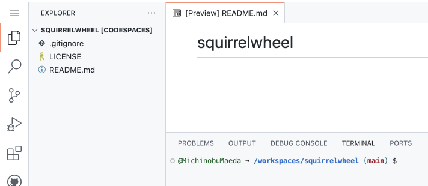

# GitHub Codespaces で Laravel を使った開発

Update: 2022-12-03

レンタルサーバ上で動くツールを作成することになりました。
最近の共用型レンタルサーバでは Composer が動くので Laravel を使います。
公開して困るような内容ではないのでソースはとりあえず GitHub の私のところに Public で置きます。

まず GitHub でリポジトリを新規作成します。

- README は追加する。
- `.gitignore` は不要。 Laravel プロジェクト作成時に生成される。
- ライセンスは Laravel と同じ MIT とする。

main ブランチで Codespace を作成します。


すると少し待たされて VS Code が表示されます。



ターミナルで環境を見るとこんな感じで必要なものはそろっているようです。テスト用のDBをSQLiteにすればテストもできますね。

```
$ cat /etc/debian_version 
bullseye/sid

$ php --version
PHP 8.1.4 ... ... ...

$ composer --version
 ... ... ...
Composer version 2.4.4 2022-10-27 14:39:29

$ node --version
v16.18.1
```

composer でプロジェクトを作成します。

```
$ cd ..
$ mv squirrelwheel squirrelwheel_org
$ composer create-project laravel/laravel squirrelwheel
$ cd squirrelwheel
$ mv ../squirrelwheel_org/.git ./
$ mv ../squirrelwheel_org/LICENSE ./
$ mv ../squirrelwheel_org/README.md ./
$ git status
On branch main
Your branch is up to date with 'origin/main'.
 ... ... ...
```

ここまででとりあえず commit & push しておきます。

次に `php artisan serve` で開発用サーバを起動すると「ポート転送するか？」と聞かれるます。


ボタン "Open in Browser" をクリックするとプロジェクト作成時に生成されたページが表示されました。


この後の作業もすべて Codespace 内でできそうです。

VS Code の拡張は "PHP Extension Pack" と "Laravel Extension Pack"  と "SQLite Viewer" を入れました。

作業が終わったら Codespace を止めます。


Tag: codespaces laravel
