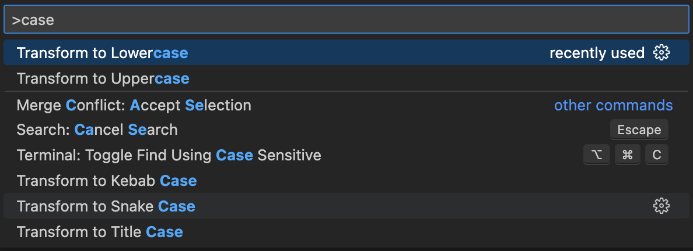

# VS Code で大文字・小文字変換

Update: 2023-01-22

VS Code のメニューには大文字・小文字変換のような項目がありません。どうすればいいの？と検索すると、ショートカットキーの設定の例が出てます。
[https://stackoverflow.com/questions/35184509/make-selected-block-of-text-uppercase](Make selected block of text uppercase)

でも、ショートカットを覚えておくほど頻繁に使うわけではないです。
vi どころか emacs でもキー・アサインを覚えるのが嫌で利用をやめてしまった私に、そんなことを言われても、ねぇ。。。

とりあえず、変換したい文字列を選択して `⌘ + Shift + P` ( Windows は `Ctrl + Shift + P` ) を押して、
"case" と入力すると、おぉ、いい感じです。 Lowercase と Uppercase だけでなく Kebab Case や Snake Case も候補に出ています。

元: `vs code to x case`

Uppercase: `VS CODE TO X CASE`

Title case: `Vs Code To X Case`

元: `VsCodeToXCase`

Kebab case: `vs-code-to-x-case`

Snake case: `vs_code_to_x_case`

Tag: vscode
