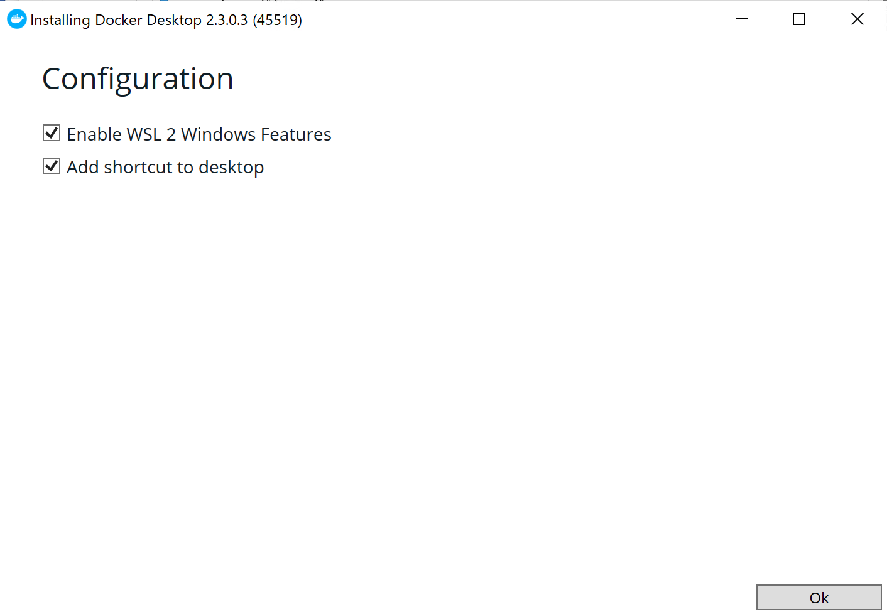
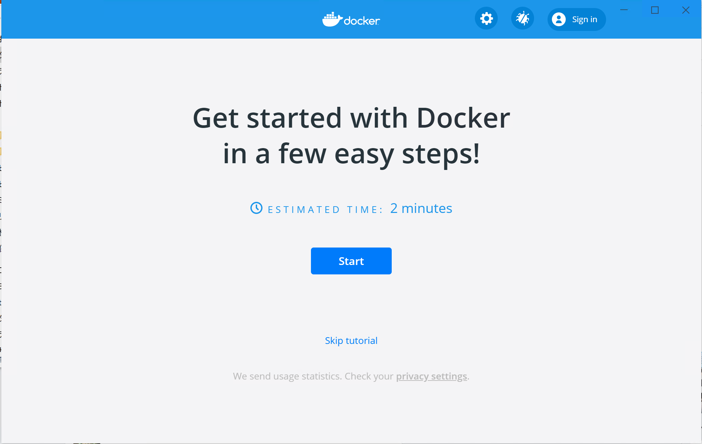
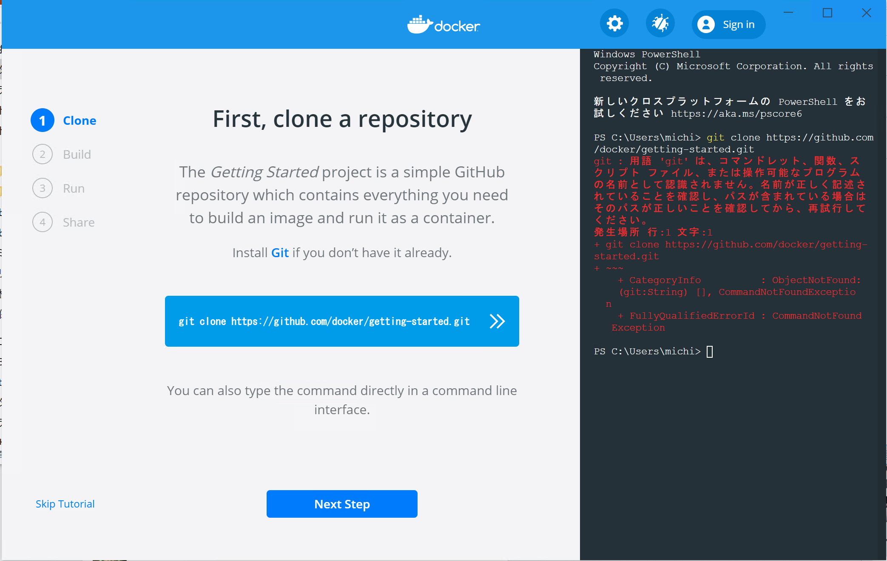

WSL 2 に Docker を入れる
=====

Update: 2020-07-31


私の Windows 10 PC にようやく WSL 2 が来ました。
OneDrive がトラブっているのが原因で Windows のアップデートができないようだということまでわかったものの OneDrive のアンインストールなどの迂回策をとることができず、結局 OS をリセットしました。私の場合、メインのマシンが Mac で Windows のローカルに必要なデータはまったくないので、まあ、なんとか。

WSL 2 の導入手順は「 [Windows 10 用 Windows Subsystem for Linux のインストール ガイド](https://docs.microsoft.com/ja-jp/windows/wsl/install-win10) 」など見てください。

ディストリビューションはどれでもいいです。私は Debian を入れました。

```
PS C:\WINDOWS\system32> wsl --list --verbose
  NAME      STATE           VERSION
* Debian    Running         2
```

Docker Desktop は https://www.docker.com/products/docker-desktop からインストーラをダウンロードして起動します。



"Enable WSL 2 Windows Features" というチェックボックスがありますね。 WSL 2 は自動で入れてくれるようです。私の場合はディストリビューションの指定があるので先に入れておく手順でやる必要があることにかわりにはなさそうです。



インストールが終わったらところで [Start] ボタンを押すと、実際に Docker コンテナを動かすテストが始まります。



でも、私は git をインストールしていなかったのでエラーになりました。気にせずテストを先に進めて真っ赤のまま終わらせます。

終わったら WSL の bash を起動します。私の場合はスタートメニューの "Debian" です。そこで ``docker`` コマンドを実行すると使用方法が表示されます。

```
$ docker

Usage:  docker [OPTIONS] COMMAND

A self-sufficient runtime for containers

Options:
      --config string      Location of client config files (default "/home/michinobu/.docker")
  -c, --context string     Name of the context to use to connect to the daemon (overrides DOCKER_HOST env var and

 ... ... ... 途中略 ... ... ...

  version     Show the Docker version information
  wait        Block until one or more containers stop, then print their exit codes

Run 'docker COMMAND --help' for more information on a command.

```

``id`` コマンドを実行すると ``docker`` グループに入っています。
[Post-installation steps for Linux](https://docs.docker.com/engine/install/linux-postinstall/)
の手順は自動で実行してくれていたようです。

```
$ id
uid=1000(michinobu) gid=1000(michinobu) groups=1000(michinobu),4(adm),24(cdrom),27(sudo),30(dip),46(plugdev),1001(docker)
```

Hello World も問題なし。

```
$ docker run hello-world
docker: Got permission denied while trying to connect to the Docker daemon socket at unix:///var/run/docker.sock: Post http://%2Fvar%2Frun%2Fdocker.sock/v1.40/containers/create: dial unix /var/run/docker.sock: connect: permission denied.
See 'docker run --help'.
```

以前「 gitlabcicddockernodefirebase 」で作成したイメージを最新にしてみます。やることは簡単で、作業用のディレクトリに ''Docker'' ファイルを置いて、そのディレクトリで

```
$ docker build -t michinobumaeda/firebase-tools .
$ docker login
$ docker push michinobumaeda/firebase-tools
```

とコマンドをたたくだけです。ただし "latest" だけでなく旧バージョンを残したい場合はタグを指定してください。

Tag: windows docker wsl


