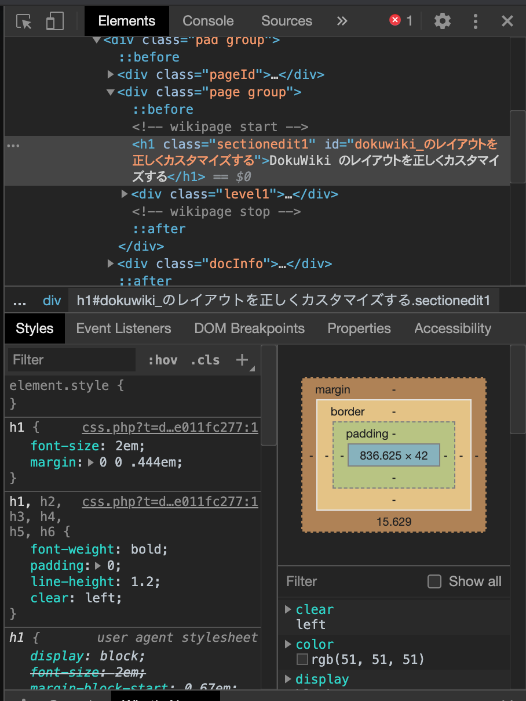

このサイトのレイアウトを変更してみる
=====

Update: 2020-07-14

追記: 現在、当サイトは DokuWiki を使っていません。

以前、別のサイトのカスタマイズをした時のことを [DokuWiki のレイアウトを正しくカスタマイズする](dokuwikiuserstyle.html) に残していたのですが今度は自分のサイトでやってみます。

まず、ロゴとアイコンは ``logo.png`` と ``favicon.ico`` のファイル名で名前空間無し ( ルート ) にアップロードしさえすれば自動で置き換わります。

アプリのテーマカラー ( 例えば Android スマホで表示した場合のブラウザの上部の色 ) は管理メニュー「テンプレートのスタイル設定」で設定するか、 ``lib/tpl/テンプレート名/style.ini`` を直接編集します。

その他、管理者メニュー「サイト設定」で変更できることはそこでやってしまいます。

それ以外は ``conf/userstyle.css`` かまたは ``conf/userstyle.less`` でどうにかします。それでどうにかならないようなら自分でテンプレートを作るしかないでしょう。

スタイルを設定したい箇所ののクラスや ID はブラウザの開発者機能で調べます。 Chrome はこんな感じ。 Firefox も同様です。左上端のボタンをクリックした後で、ページ上の調べたい箇所をクリックすると、該当する HTML要素とそこに効いている CSS の定義を表示してくれます。 Wiki や Blog で自動出力されたコンテンツの場合、これ無しで人間がコードを読んで解析するのはとてもじゃないけど無理です。



作成した CSS は以下のうようになります。游ゴシックは Windows で薄く表示されるので、少し太めにしました。それから、検索以外のサイトツールは非表示に。

```
body {
  font-family: "Montserrat","游ゴシック",YuGothic,"ヒラギノ角ゴ ProN W3","Hiragino Kaku Gothic ProN","メイリオ",Meiryo,sans-serif;
  font-size: 110%;
  font-weight: 500;
  background-color: #101010;
}
#dokuwiki__header .tools li,
#dokuwiki__header h1 span,
.dokuwiki div.breadcrumbs,
.dokuwiki .docInfo,
#dokuwiki__footer {
  color: snow;
}
#dokuwiki__header a,
#dokuwiki__footer a {
  color: PaleTurquoise;
}
p, li, td, dd {
  line-height: 1.75em;
}
#dokuwiki__header {
  padding: 0.75em 0 0.25em 0;
}
#dokuwiki__usertools,
#dokuwiki__sitetools ul,
#dokuwiki__header ul.a11y.skip,
#dokuwiki__header .mobileTools select,
.dokuwiki .pageId,
#dokuwiki__pagetools div.tools {
  display: none;
}
#dokuwiki__sitetools form#dw__search {
  width: 99%;
}
#dokuwiki__header .headings,
#dokuwiki__header .tools {
  margin-bottom: 0.25em;
}
.dokuwiki div.page h1 {
 margin: 0 0 1em 0;
 padding: 0 0.1em 0 0.1em;
 border-bottom: dotted 4px DarkSlateGrey;
 color: DarkSlateGrey;
 font-size: 1.6em;
}
.dokuwiki div.page h2 {
 padding: 0 0.1em 0 0.1em;
 border-bottom: dashed 2px #606060;
 color: #606060;
 font-size: 1.4em;
}
.dokuwiki div.page h3 {
 padding: 0 0.1em 0 0.1em;
 border-bottom: solid 1px #606060;
 color: #303030;
 font-size: 1.2em;
}
.autoarchive_selector {
 padding-bottom: 48px;
}
.autoarchive_selector ul {
  padding-left: 0;
}
div.dokuwiki div.autoarchive_selector ul,
div.dokuwiki div.autoarchive_selector ul div.li {
  margin: 0;
}
div.dokuwiki div.autoarchive_selector ul li {
  margin-left: 0.75em;
}
```


Tag: dokuwiki


