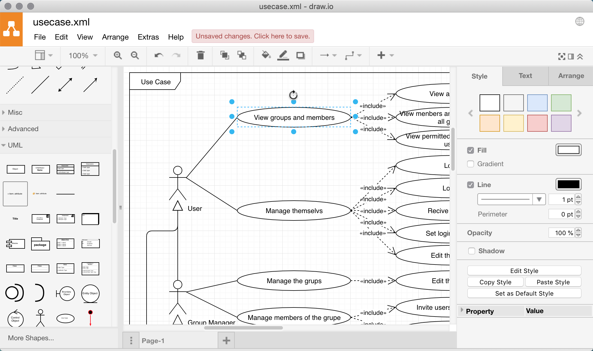

draw.io で作図
=====

Update: 2018-11-10

まだ [Laraval 5 による開発の手順 #6](startlaravel6.html) の途中ですが、
そろそろ要件と仕様を整理しておかないとまずいなと作図ツールを探してみました。

ダイアグラムの作図については Windows の Visio や Mac の OmniGraffle など昔から知られた良いツールがあるのですが、
これらは有償でプラットフォーム依存です。
フリーで、マルチプラットフォームで、できればタブレット等でも使えるものがあるとうれしいなと思っていたら
[draw.io](https://www.draw.io)
というものがありました。

オンライン版を少し触って出来の良さに驚きました。
オンラインの無償版の場合ファイルの保存場所は用意してくれていませんが、
Google Drive, OneDrive, DropBox, ローカルデバイスなどを選択できます。

Windows, Mac, Linux 向けのデスクトップ版もこちらからダウンロードできます。

https://about.draw.io/integrations/#integrations_offline

Mac にダウンロードして中をのぞいてみたところ、
デスクトップ用アプリの基盤には
[Electron](https://electronjs.org) を使っているようです。

まず最初に UML の Use Case 図を描いて見ました。
コネクタの調整が細かくできて、きれいに描くことができます。
作業スピード優先で設計された UI の使い勝手は慣れると楽でいいのですが、
Visio 等より若干とっつきにくいかもしれません。

Tag: PHP draw.io Electron
