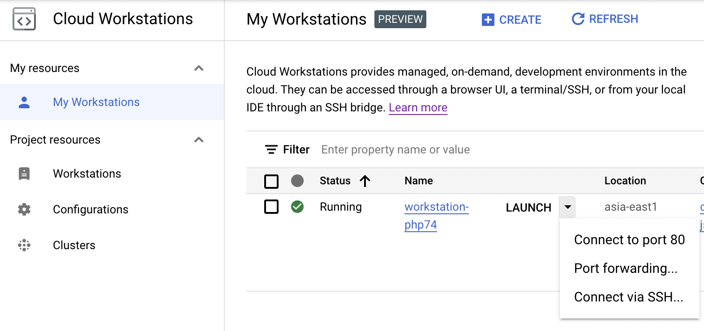

# Google Cloud Workstations を使ってみる

Update: 2022-10-22

Google が Cloud Workstations というサービスをはじめました。まだ Preview です。 Docker コンテナに Web版の Code OSS などのエディタやポートフォワーディングの機能が付いています。類似のものは GitHub など他からもでているのですが、私の用途に微妙に合わないところがあって使っていませんでした。これが使えると自分のPCの性能はどうでもよくなります。複数の環境の同居の仕組みで悩む必要もなくなります。

## 接続元の環境

ポートフォワーディングやSSH接続を使う場合は gcloud CLI が必要なので iPad は難しいかな。でも Chromebook は問題なさそうです。一度 Linux 環境を入れてみたもののそれっきりになっていた非力な Chromebook で試してみます。

Chromebook 上の古い Debian は削除して、入れ直してみました。こんな感じです。

```
michinobu@penguin:~$ sudo apt update
michinobu@penguin:~$ sudo apt upgrade
michinobu@penguin:~$ cat /etc/debian_version
11.5
michinobu@penguin:~$ lscpu
Architecture:                    x86_64
 ... ... ...
michinobu@penguin:~$ python3 --version
Python 3.9.2
```

gcloud CLI のインストール手順はこちら <https://cloud.google.com/sdk/docs/install> です。
gcloud CLI をインストールする前に Google Cloud のアカウントと、最初のプロジェクトの作成が必要です。
Windows で Python が入っていない場合はインストーラが簡単です。 
デフォルトの設定でインストールすると、最初に以下の設置が必要になります。

- Google Cloud のアカウントでログイン（これがないと何もできない）
- デフォルトのリージョン（地域）の選択
    - asia-northeast1: 東京
    - asia-northeast2: 大阪
    - asia-northeast3: ソウル
- プロジェクトの選択

Windows にインストールした後の初回の gcloud コマンド実行で「このシステムではスクリプトの実行が無効になっているため ... 」というエラーが出る場合は PowerShell を「管理者として実行」して以下のコマンドを実行してください。

```
> Set-ExecutionPolicy RemoteSigned
```

## Workstation　の作成

まず GCP のプロジェクトの Billing と Cloud Workstations API を有効にしてください。

メニューから Cloud Workstations を開くと、メニュー項目として

- Workstations
- Configurations
- Clusters

が並んでいます。下から順番に作成します。

最初に Cluster を作成します。
デフォルトは Public で、単純な構成ならデフォルトのままで良いと思います。
Public とはいっても SSH tunnel を使うしかない環境ですので、通常の用途でしたらセキュリティはそれでだいじょうぶでしょう。
Cluster の作成には20分くらいかかります。

次に Configuration を作成します。
"Quick start workstations" はカネかかりそうなので無効にしました。
今回は Apache + PHP の単純な Webサイトのテスト環境にしたいだけなので、
"Machine type" は一番小さなものにしています。
エディタなどもここで選択できます。私は普段 VS Code を使っているので、デフォルトの Code OSS としました。

最後に Workstation を作成します。名称を決めて Configuration を選択するだけです。

一覧の中の Workstation を "Start" すると 2分40秒くらいで起動して
"START" が "LAUNCH" に変わります。
"LAUNCH" をクリックすると Code OSS が表示されます。ブラウザを全画面表示にすると、デスクトップ版の VS Code とほとんど同じですね。

Code OSS でターミナルを開くとこんな感じで、普通の最小構成の Debian のようです。

```
user@workstation-test:~$ pwd
/home/user
user@workstation-test:~$ echo $SHELL
/bin/bash
user@workstation-test:~$ cat /etc/debian_version
11.5
user@workstation-test:~$ python3 --version
Python 3.10.7
user@workstation-test:~$ git --version
git version 2.30.2
```

"LAUNCH" の右の ▼ をクリックすると Port forwarding や SSH 接続の手順が表示されます。



HTTPサーバ等を動かす場合、ポート 80 は Code OSS のために使われているので他のポートにしてください。

```
user@workstation-php74:~$ curl localhost:80
<!-- Copyright (C) Microsoft Corporation. All rights reserved. -->
<!DOCTYPE html>
<html>
 ... ... ...
```

## 追記: 2022-10-26

手元のPCから `scp` するときはこんなオプションが必要です。

```
$ scp -o "UserKnownHostsFile=/dev/null" -o "StrictHostKeyChecking=no" -P 2222 from_path user@localhost:/home/user/
```

Workstation を再起動するとどうも `sudo apt install` で入れたものが残っていないような。。。代わりに Mac で使い慣れている Homebrew を使いました。

Tag: cloud
