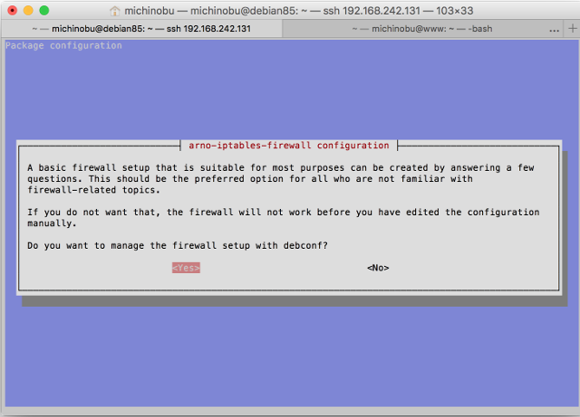
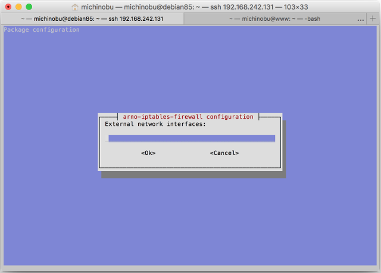
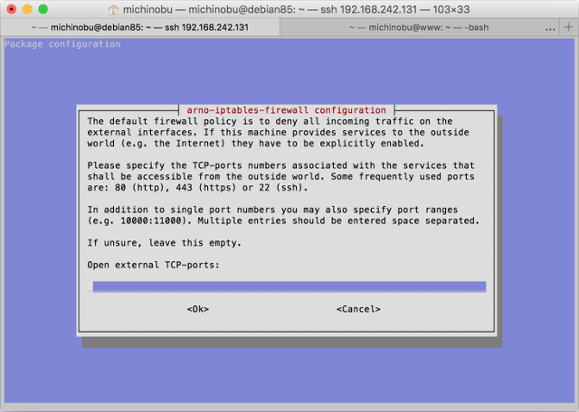
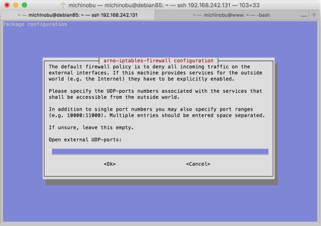
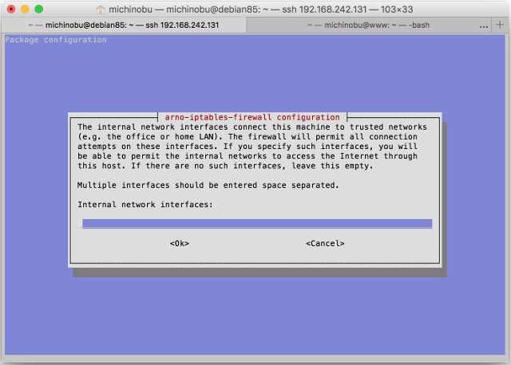
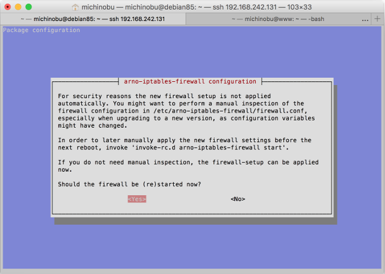

arno-iptables-firewall は楽でいい
=====

Update: 2016-09-04


Debian で iptables を設定しようとしたのですが、どうせ特別変わった設定が必要なわけではないし簡単にできるものはないか、GUIは無しで、と [https://wiki.debian.org/Firewalls](https://wiki.debian.org/Firewalls) の一覧の先頭に載ってる arno-iptables-firewall を使ってみました。詳しいことは [https://github.com/arno-iptables-firewall/aif/](https://github.com/arno-iptables-firewall/aif/) を。Debian 8.5 の場合 apt-get で入れられます。


まず、 Debian 8.5 の初期状態はこんな感じ。

```
# iptables-save

# Generated by iptables-save v1.4.21 on Sat Sep` `3 23:58:04 2016
*filter
:INPUT ACCEPT [23:1592]
:FORWARD ACCEPT [0:0]
:OUTPUT ACCEPT [12:1376]
COMMIT
```

作業を始める前に `ifconfig` などでインターフェイスの名称 ( eth0 とか ) を調べておきます。


arno-iptables-firewall を入れます。

```
# apt-get update
# apt-get install arno-iptables-firewall
```

するとまず「debconf でファイアウォールの設定するか？」と聞かれるので Yes を選択。



次に、外側、つまりインンターネットの側のインターフェイスの名前を聞かれるので eth0 等と記入します。複数ある場合はスペースで区切れとのことです。



その次に、外側、つまりインンターネットの側のインターフェイスで使うTCPのポートを聞かれるので `22 80 443` のようにスペース区切りで記入します。



UPDのポートについても聞かれます。無しの場合は何も記入せずに OK します。



内側のインターフェイスを聞かれるので、あれば記入します。



最後に、設定の結果の適用の有無を聞かれます。設定内容を確認したい場合は `/etc/arno-iptables-firewall/firewall.conf` を見ればいいそうです。後で結果を適用したい場合は、リブート前に `'``invoke-rc.d arno-iptables-firewall start``'` を実行しろとのことです。



ここまで設定した内容はこの設定ファイルに入っているようです。

```
# cat /etc/arno-iptables-firewall/conf.d/00debconf.conf`

#######################################################################
# Feel free to edit this file.` `However, be aware that debconf writes #
# to (and reads from) this file too.` `In case of doubt, only use` `#
# 'dpkg-reconfigure -plow arno-iptables-firewall' to edit this file.` `#
# If you really don't want to use debconf, or if you have specific` `#
# needs, you're likely better off using placing an additional` `#
# configuration snippet into/etc/arno-iptables-firewall/conf.d/.` `#
# Also see README.Debian.` `#
#######################################################################
EXT_IF="eth0"
EXT_IF_DHCP_IP=1
OPEN_TCP="22 80 443"
OPEN_UDP=""
INT_IF=""
NAT=0
INTERNAL_NET=""
NAT_INTERNAL_NET=""
OPEN_ICMP=0
```

再設定したい場合は `'``dpkg-reconfigure -plow arno-iptables-firewall``'` を実行しろとのことです。


最後の行を見ると `OPEN_ICMP=0` となっていますが、確かに ping は受け付けなくなっています。ま、このサーバの場合はそれでいいかな。 Web も ssh も通じなくなって ping だけ反応されてもできることはあまりなさそうだし。

`iptables-save` で見るとなんだかたくさん設定されています。これは私には無理だな。

```
# iptables-save`

# Generated by iptables-save v1.4.21 on Sun Sep` `4 00:55:37 2016
*nat
:PREROUTING ACCEPT [17:2968]
:INPUT ACCEPT [1:64]
:OUTPUT ACCEPT [5:404]
:POSTROUTING ACCEPT [5:404]
:NAT_POSTROUTING_CHAIN - [0:0]
:NAT_PREROUTING_CHAIN - [0:0]
:POST_NAT_POSTROUTING_CHAIN - [0:0]
:POST_NAT_PREROUTING_CHAIN - [0:0]
-A PREROUTING -j NAT_PREROUTING_CHAIN
-A PREROUTING -j POST_NAT_PREROUTING_CHAIN
-A POSTROUTING -j NAT_POSTROUTING_CHAIN
-A POSTROUTING -j POST_NAT_POSTROUTING_CHAIN
COMMIT
# Completed on Sun Sep` `4 00:55:37 2016
# Generated by iptables-save v1.4.21 on Sun Sep` `4 00:55:37 2016
*mangle
:PREROUTING ACCEPT [378:29809]
:INPUT ACCEPT [378:29809]
:FORWARD ACCEPT [0:0]
:OUTPUT ACCEPT [238:80387]
:POSTROUTING ACCEPT [238:80387]
COMMIT
# Completed on Sun Sep` `4 00:55:37 2016
# Generated by iptables-save v1.4.21 on Sun Sep` `4 00:55:37 2016
*filter
:INPUT DROP [0:0]
:FORWARD DROP [0:0]
:OUTPUT DROP [0:0]
:BASE_FORWARD_CHAIN - [0:0]
:BASE_INPUT_CHAIN - [0:0]
:BASE_OUTPUT_CHAIN - [0:0]
:DMZ_FORWARD_IN_CHAIN - [0:0]
:DMZ_FORWARD_OUT_CHAIN - [0:0]
:DMZ_INET_FORWARD_CHAIN - [0:0]
:DMZ_INPUT_CHAIN - [0:0]
:DMZ_LAN_FORWARD_CHAIN - [0:0]
:DMZ_OUTPUT_CHAIN - [0:0]
:EXT_BROADCAST_CHAIN - [0:0]
:EXT_FORWARD_IN_CHAIN - [0:0]
:EXT_FORWARD_OUT_CHAIN - [0:0]
:EXT_ICMP_FLOOD_CHAIN - [0:0]
:EXT_INPUT_CHAIN - [0:0]
:EXT_MULTICAST_CHAIN - [0:0]
:EXT_OUTPUT_CHAIN - [0:0]
:FORWARD_CHAIN - [0:0]
:HOST_BLOCK_DROP - [0:0]
:HOST_BLOCK_DST - [0:0]
:HOST_BLOCK_SRC - [0:0]
:INET_DMZ_FORWARD_CHAIN - [0:0]
:INPUT_CHAIN - [0:0]
:INT_FORWARD_IN_CHAIN - [0:0]
:INT_FORWARD_OUT_CHAIN - [0:0]
:INT_INPUT_CHAIN - [0:0]
:INT_OUTPUT_CHAIN - [0:0]
:LAN_INET_FORWARD_CHAIN - [0:0]
:OUTPUT_CHAIN - [0:0]
:POST_FORWARD_CHAIN - [0:0]
:POST_INPUT_CHAIN - [0:0]
:POST_INPUT_DROP_CHAIN - [0:0]
:POST_OUTPUT_CHAIN - [0:0]
:RESERVED_NET_CHK - [0:0]
:SPOOF_CHK - [0:0]
:VALID_CHK - [0:0]
-A INPUT -j BASE_INPUT_CHAIN
-A INPUT -j INPUT_CHAIN
-A INPUT -j HOST_BLOCK_SRC
-A INPUT -j SPOOF_CHK
-A INPUT -i eth0 -j VALID_CHK
-A INPUT -i eth0 ! -p icmp -m state --state NEW -j EXT_INPUT_CHAIN
-A INPUT -i eth0 -p icmp -m state --state NEW -m limit --limit 60/sec --limit-burst 100 -j EXT_INPUT_CHAIN
-A INPUT -i eth0 -p icmp -m state --state NEW -j EXT_ICMP_FLOOD_CHAIN
-A INPUT -j POST_INPUT_CHAIN
-A INPUT -m limit --limit 1/sec -j LOG --log-prefix "AIF:Dropped INPUT packet: " --log-level 6
-A INPUT -j DROP
-A FORWARD -j BASE_FORWARD_CHAIN
-A FORWARD -o eth0 -p tcp -m tcp --tcp-flags SYN,RST SYN -j TCPMSS --clamp-mss-to-pmtu
-A FORWARD -j FORWARD_CHAIN
-A FORWARD -j HOST_BLOCK_SRC
-A FORWARD -j HOST_BLOCK_DST
-A FORWARD -i eth0 -j EXT_FORWARD_IN_CHAIN
-A FORWARD -o eth0 -j EXT_FORWARD_OUT_CHAIN
-A FORWARD -j SPOOF_CHK
-A FORWARD -j POST_FORWARD_CHAIN
-A FORWARD -m limit --limit 1/min --limit-burst 3 -j LOG --log-prefix "AIF:Dropped FORWARD packet: " --log-level 6
-A FORWARD -j DROP
-A OUTPUT -j BASE_OUTPUT_CHAIN
-A OUTPUT -o eth0 -p tcp -m tcp --tcp-flags SYN,RST SYN -j TCPMSS --clamp-mss-to-pmtu
-A OUTPUT -j OUTPUT_CHAIN
-A OUTPUT -j HOST_BLOCK_DST
-A OUTPUT -f -m limit --limit 3/min -j LOG --log-prefix "AIF:Fragment packet: " --log-level 6
-A OUTPUT -f -j DROP
-A OUTPUT -o eth0 -j EXT_OUTPUT_CHAIN
-A OUTPUT -j POST_OUTPUT_CHAIN
-A OUTPUT -j ACCEPT
-A BASE_FORWARD_CHAIN -m state --state ESTABLISHED -j ACCEPT
-A BASE_FORWARD_CHAIN -p tcp -m state --state RELATED -m tcp --dport 1024:65535 -j ACCEPT
-A BASE_FORWARD_CHAIN -p udp -m state --state RELATED -m udp --dport 1024:65535 -j ACCEPT
-A BASE_FORWARD_CHAIN -p icmp -m state --state RELATED -j ACCEPT
-A BASE_FORWARD_CHAIN -i lo -j ACCEPT
-A BASE_INPUT_CHAIN -m state --state ESTABLISHED -j ACCEPT
-A BASE_INPUT_CHAIN -p tcp -m state --state RELATED -m tcp --dport 1024:65535 -j ACCEPT
-A BASE_INPUT_CHAIN -p udp -m state --state RELATED -m udp --dport 1024:65535 -j ACCEPT
-A BASE_INPUT_CHAIN -p icmp -m state --state RELATED -j ACCEPT
-A BASE_INPUT_CHAIN -i lo -j ACCEPT
-A BASE_OUTPUT_CHAIN -m state --state ESTABLISHED -j ACCEPT
-A BASE_OUTPUT_CHAIN -o lo -j ACCEPT
-A EXT_BROADCAST_CHAIN -p tcp -m tcp --dport 0:1023 -m limit --limit 6/min --limit-burst 2 -j LOG --log-prefix "AIF:PRIV TCP broadcast: " --log-level 6
-A EXT_BROADCAST_CHAIN -p udp -m udp --dport 0:1023 -m limit --limit 6/min --limit-burst 2 -j LOG --log-prefix "AIF:PRIV UDP broadcast: " --log-level 6
-A EXT_BROADCAST_CHAIN -p tcp -m tcp --dport 1024:65535 -m limit --limit 6/min --limit-burst 2 -j LOG --log-prefix "AIF:UNPRIV TCP broadcast: " --log-level 6
-A EXT_BROADCAST_CHAIN -p udp -m udp --dport 1024 -m limit --limit 6/min --limit-burst 2 -j LOG --log-prefix "AIF:UNPRIV UDP broadcast: " --log-level 6
-A EXT_BROADCAST_CHAIN -j DROP
-A EXT_FORWARD_IN_CHAIN -j VALID_CHK
-A EXT_ICMP_FLOOD_CHAIN -p icmp -m icmp --icmp-type 3 -m limit --limit 12/hour --limit-burst 1 -j LOG --log-prefix "AIF:ICMP-unreachable flood: " --log-level 6
-A EXT_ICMP_FLOOD_CHAIN -p icmp -m icmp --icmp-type 3 -j POST_INPUT_DROP_CHAIN
-A EXT_ICMP_FLOOD_CHAIN -p icmp -m icmp --icmp-type 11 -m limit --limit 12/hour --limit-burst 1 -j LOG --log-prefix "AIF:ICMP-time-exceeded fld: " --log-level 6
-A EXT_ICMP_FLOOD_CHAIN -p icmp -m icmp --icmp-type 11 -j POST_INPUT_DROP_CHAIN
-A EXT_ICMP_FLOOD_CHAIN -p icmp -m icmp --icmp-type 12 -m limit --limit 12/hour --limit-burst 1 -j LOG --log-prefix "AIF:ICMP-param-problem fld: " --log-level 6
-A EXT_ICMP_FLOOD_CHAIN -p icmp -m icmp --icmp-type 12 -j POST_INPUT_DROP_CHAIN
-A EXT_ICMP_FLOOD_CHAIN -p icmp -m icmp --icmp-type 8 -m limit --limit 12/hour --limit-burst 1 -j LOG --log-prefix "AIF:ICMP-request(ping) fld: " --log-level 6
-A EXT_ICMP_FLOOD_CHAIN -p icmp -m icmp --icmp-type 8 -j POST_INPUT_DROP_CHAIN
-A EXT_ICMP_FLOOD_CHAIN -p icmp -m icmp --icmp-type 0 -m limit --limit 12/hour --limit-burst 1 -j LOG --log-prefix "AIF:ICMP-reply(pong) flood: " --log-level 6
-A EXT_ICMP_FLOOD_CHAIN -p icmp -m icmp --icmp-type 0 -j POST_INPUT_DROP_CHAIN
-A EXT_ICMP_FLOOD_CHAIN -p icmp -m icmp --icmp-type 4 -m limit --limit 12/hour --limit-burst 1 -j LOG --log-prefix "AIF:ICMP-source-quench fld: " --log-level 6
-A EXT_ICMP_FLOOD_CHAIN -p icmp -m icmp --icmp-type 4 -j POST_INPUT_DROP_CHAIN
-A EXT_ICMP_FLOOD_CHAIN -p icmp -m limit --limit 12/hour --limit-burst 1 -j LOG --log-prefix "AIF:ICMP(other) flood: " --log-level 6
-A EXT_ICMP_FLOOD_CHAIN -p icmp -j POST_INPUT_DROP_CHAIN
-A EXT_INPUT_CHAIN -p tcp -m tcp --dport 0 -m limit --limit 6/hour --limit-burst 1 -j LOG --log-prefix "AIF:Port 0 OS fingerprint: " --log-level 6
-A EXT_INPUT_CHAIN -p udp -m udp --dport 0 -m limit --limit 6/hour --limit-burst 1 -j LOG --log-prefix "AIF:Port 0 OS fingerprint: " --log-level 6
-A EXT_INPUT_CHAIN -p tcp -m tcp --dport 0 -j POST_INPUT_DROP_CHAIN
-A EXT_INPUT_CHAIN -p udp -m udp --dport 0 -j POST_INPUT_DROP_CHAIN
-A EXT_INPUT_CHAIN -p tcp -m tcp --sport 0 -m limit --limit 6/hour -j LOG --log-prefix "AIF:TCP source port 0: " --log-level 6
-A EXT_INPUT_CHAIN -p udp -m udp --sport 0 -m limit --limit 6/hour -j LOG --log-prefix "AIF:UDP source port 0: " --log-level 6
-A EXT_INPUT_CHAIN -p tcp -m tcp --sport 0 -j POST_INPUT_DROP_CHAIN
-A EXT_INPUT_CHAIN -p udp -m udp --sport 0 -j POST_INPUT_DROP_CHAIN
-A EXT_INPUT_CHAIN -p udp -m udp --sport 67 --dport 68 -j ACCEPT
-A EXT_INPUT_CHAIN -p tcp -m tcp --dport 22 -j ACCEPT
-A EXT_INPUT_CHAIN -p tcp -m tcp --dport 80 -j ACCEPT
-A EXT_INPUT_CHAIN -p tcp -m tcp --dport 443 -j ACCEPT
-A EXT_INPUT_CHAIN -p tcp -m tcp --dport 1024:65535 ! --tcp-flags FIN,SYN,RST,ACK SYN -m limit --limit 3/min -j LOG --log-prefix "AIF:Stealth scan? (UNPRIV): " --log-level 6
-A EXT_INPUT_CHAIN -p tcp -m tcp --dport 0:1023 ! --tcp-flags FIN,SYN,RST,ACK SYN -m limit --limit 3/min -j LOG --log-prefix "AIF:Stealth scan? (PRIV): " --log-level 6
-A EXT_INPUT_CHAIN -p tcp -m tcp ! --tcp-flags FIN,SYN,RST,ACK SYN -j POST_INPUT_DROP_CHAIN
-A EXT_INPUT_CHAIN -d 255.255.255.255/32 -j EXT_BROADCAST_CHAIN
-A EXT_INPUT_CHAIN -d 224.0.0.0/4 -j EXT_MULTICAST_CHAIN
-A EXT_INPUT_CHAIN -p tcp -m tcp --dport 0:1023 -m limit --limit 6/min --limit-burst 2 -j LOG --log-prefix "AIF:PRIV TCP packet: " --log-level 6
-A EXT_INPUT_CHAIN -p udp -m udp --dport 0:1023 -m limit --limit 6/min --limit-burst 2 -j LOG --log-prefix "AIF:PRIV UDP packet: " --log-level 6
-A EXT_INPUT_CHAIN -p tcp -m tcp --dport 1024:65535 -m limit --limit 6/min --limit-burst 2 -j LOG --log-prefix "AIF:UNPRIV TCP packet: " --log-level 6
-A EXT_INPUT_CHAIN -p udp -m udp --dport 1024:65535 -m limit --limit 6/min --limit-burst 2 -j LOG --log-prefix "AIF:UNPRIV UDP packet: " --log-level 6
-A EXT_INPUT_CHAIN -p igmp -m limit --limit 1/min -j LOG --log-prefix "AIF:IGMP packet: " --log-level 6
-A EXT_INPUT_CHAIN -j POST_INPUT_CHAIN
-A EXT_INPUT_CHAIN -p icmp -m icmp --icmp-type 8 -m limit --limit 3/min --limit-burst 1 -j LOG --log-prefix "AIF:ICMP-request: " --log-level 6
-A EXT_INPUT_CHAIN -p icmp -m icmp ! --icmp-type 8 -m limit --limit 12/hour --limit-burst 1 -j LOG --log-prefix "AIF:ICMP-other: " --log-level 6
-A EXT_INPUT_CHAIN -p tcp -j POST_INPUT_DROP_CHAIN
-A EXT_INPUT_CHAIN -p udp -j POST_INPUT_DROP_CHAIN
-A EXT_INPUT_CHAIN -p igmp -j POST_INPUT_DROP_CHAIN
-A EXT_INPUT_CHAIN -p icmp -j POST_INPUT_DROP_CHAIN
-A EXT_INPUT_CHAIN -m limit --limit 1/min -j LOG --log-prefix "AIF:Other connect: " --log-level 6
-A EXT_INPUT_CHAIN -j POST_INPUT_DROP_CHAIN
-A EXT_MULTICAST_CHAIN -p tcp -m tcp --dport 0:1023 -m limit --limit 6/min --limit-burst 2 -j LOG --log-prefix "AIF:PRIV TCP multicast: " --log-level 6
-A EXT_MULTICAST_CHAIN -p udp -m udp --dport 0:1023 -m limit --limit 6/min --limit-burst 2 -j LOG --log-prefix "AIF:PRIV UDP multicast: " --log-level 6
-A EXT_MULTICAST_CHAIN -p tcp -m tcp --dport 1024:65535 -m limit --limit 6/min --limit-burst 2 -j LOG --log-prefix "AIF:UNPRIV TCP multicast: " --log-level 6
-A EXT_MULTICAST_CHAIN -p udp -m udp --dport 1024 -m limit --limit 6/min --limit-burst 2 -j LOG --log-prefix "AIF:UNPRIV UDP multicast: " --log-level 6
-A EXT_MULTICAST_CHAIN -p icmp -m icmp --icmp-type 8 -m limit --limit 3/min --limit-burst 1 -j LOG --log-prefix "AIF:ICMP-multicast-request: " --log-level 6
-A EXT_MULTICAST_CHAIN -p icmp -m icmp ! --icmp-type 8 -m limit --limit 12/hour --limit-burst 1 -j LOG --log-prefix "AIF:ICMP-multicast-other: " --log-level 6
-A EXT_MULTICAST_CHAIN -j DROP
-A HOST_BLOCK_DROP -m limit --limit 1/min --limit-burst 1 -j LOG --log-prefix "AIF:Blocked host(s): " --log-level 6
-A HOST_BLOCK_DROP -j DROP
-A POST_INPUT_DROP_CHAIN -j DROP
-A SPOOF_CHK -j RETURN
-A VALID_CHK -p tcp -m tcp --tcp-flags FIN,SYN,RST,PSH,ACK,URG FIN,PSH,URG -m limit --limit 3/min -j LOG --log-prefix "AIF:Stealth XMAS scan: " --log-level 6
-A VALID_CHK -p tcp -m tcp --tcp-flags FIN,SYN,RST,PSH,ACK,URG FIN,SYN,RST,ACK,URG -m limit --limit 3/min -j LOG --log-prefix "AIF:Stealth XMAS-PSH scan: " --log-level 6
-A VALID_CHK -p tcp -m tcp --tcp-flags FIN,SYN,RST,PSH,ACK,URG FIN,SYN,RST,PSH,ACK,URG -m limit --limit 3/min -j LOG --log-prefix "AIF:Stealth XMAS-ALL scan: " --log-level 6
-A VALID_CHK -p tcp -m tcp --tcp-flags FIN,SYN,RST,PSH,ACK,URG FIN -m limit --limit 3/min -j LOG --log-prefix "AIF:Stealth FIN scan: " --log-level 6
-A VALID_CHK -p tcp -m tcp --tcp-flags SYN,RST SYN,RST -m limit --limit 3/min -j LOG --log-prefix "AIF:Stealth SYN/RST scan: " --log-level 6
-A VALID_CHK -p tcp -m tcp --tcp-flags FIN,SYN FIN,SYN -m limit --limit 3/min -j LOG --log-prefix "AIF:Stealth SYN/FIN scan?: " --log-level 6
-A VALID_CHK -p tcp -m tcp --tcp-flags FIN,SYN,RST,PSH,ACK,URG NONE -m limit --limit 3/min -j LOG --log-prefix "AIF:Stealth Null scan: " --log-level 6
-A VALID_CHK -p tcp -m tcp --tcp-flags FIN,SYN,RST,PSH,ACK,URG FIN,PSH,URG -j POST_INPUT_DROP_CHAIN
-A VALID_CHK -p tcp -m tcp --tcp-flags FIN,SYN,RST,PSH,ACK,URG FIN,SYN,RST,ACK,URG -j POST_INPUT_DROP_CHAIN
-A VALID_CHK -p tcp -m tcp --tcp-flags FIN,SYN,RST,PSH,ACK,URG FIN,SYN,RST,PSH,ACK,URG -j POST_INPUT_DROP_CHAIN
-A VALID_CHK -p tcp -m tcp --tcp-flags FIN,SYN,RST,PSH,ACK,URG FIN -j POST_INPUT_DROP_CHAIN
-A VALID_CHK -p tcp -m tcp --tcp-flags SYN,RST SYN,RST -j POST_INPUT_DROP_CHAIN
-A VALID_CHK -p tcp -m tcp --tcp-flags FIN,SYN FIN,SYN -j POST_INPUT_DROP_CHAIN
-A VALID_CHK -p tcp -m tcp --tcp-flags FIN,SYN,RST,PSH,ACK,URG NONE -j POST_INPUT_DROP_CHAIN
-A VALID_CHK -p tcp -m tcp --tcp-option 64 -m limit --limit 3/min --limit-burst 1 -j LOG --log-prefix "AIF:Bad TCP flag(64): " --log-level 6
-A VALID_CHK -p tcp -m tcp --tcp-option 128 -m limit --limit 3/min --limit-burst 1 -j LOG --log-prefix "AIF:Bad TCP flag(128): " --log-level 6
-A VALID_CHK -p tcp -m tcp --tcp-option 64 -j POST_INPUT_DROP_CHAIN
-A VALID_CHK -p tcp -m tcp --tcp-option 128 -j POST_INPUT_DROP_CHAIN
-A VALID_CHK -m state --state INVALID -j POST_INPUT_DROP_CHAIN
-A VALID_CHK -f -m limit --limit 3/min --limit-burst 1 -j LOG --log-prefix "AIF:Fragment packet: "
-A VALID_CHK -f -j DROP
COMMIT
# Completed on Sun Sep` `4 00:55:37 2016`
```
