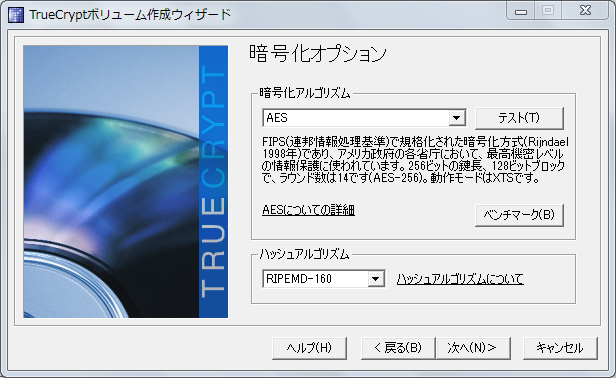
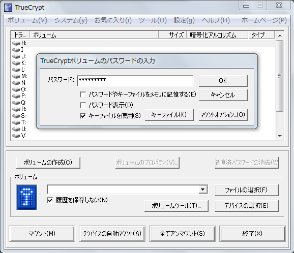

USBメモリを無料で暗号化
=====

Update: 2012-09-02

> 追記 2021-05-15: TrueCrypt はメンテナンスが止まっています。後継のツールとして
[VeraCrypt](https://veracrypt.fr/en/Home.html) などがあります。

おまけのついていない安い USBメモリを暗号化したい、 Windows でも Mac でも Linux でも使いたい、という私の贅沢な悩みを解決するツールを見つけました。 TrueCrypt [http://www.truecrypt.org/](http://www.truecrypt.org/) というフリーソフトです。 Vector 新着ソフトウェアレビュー [http://www.vector.co.jp/magazine/softnews/110831/n1108311\_reviewer.html](http://www.vector.co.jp/magazine/softnews/110831/n1108311_reviewer.html) でも紹介されていました。

さっそく Windows と Mac と Linux で試してみました。。。って PC 何台持っているのかって？ ここで使ったのは１台ですっ！！ で、ここで使わなかったのは何台かって？ いやそれは、まあ、それは置いといて (L- -)L Windows 版のインストールの手順と私の場合の使い方について説明します。

前提知識としては、暗号化しているしていないにかかわらず、USB メモリを PC からいきなり抜いたらダメということくらいかな。知らない場合は、周りの知ってそうな人にこっそり聞いてみてください。

ダウンロードは上記の Vector からでもいいし、配布元 [http://www.truecrypt.org/downloads](http://www.truecrypt.org/downloads) からでもいいです。ダウンロードした2012年9月1日現在の最新版 `TrueCrypt Setup 7.1a.exe` を実行します。

]

下の方の `I accept ...` のチェックを入れて、後はデフォルトの設定でどんどん進めてください。インストールが終わったら、Windows メニューの TruCriypt から起動してください。起動したら日本語化の設定をします。

メニューの Settings の `Language...` を選択してください。

まだ English だけしかありません。下の方の `Download Language pack` をクリックしてください。ブラウザ ( インターネットエクスプローラとか、 FireFox とか ) でダウンロードページが表示されます。もしうまくいかないようなら [http://www.truecrypt.org/localizations](http://www.truecrypt.org/localizations) を開いてください。たくさんの言語が並んでいますが、その中から日本語のファイルをダウンロードしてください。 `langpack-ja-1.0.0-for-truecrypt-7.1a.zip` のようなファイル名です。ファイルを解凍すると、

*   `Language.ja.xml`
*   `Readme.txt`

というファイルが入っています。 Readme.txt の方に説明が書いてあります。英語で。要するに、 TrueCrypt をインストールしたフォルダ ( インストールの際に等に変更していなければ `C:\Program Files\TrueCrypt` ) に Language.ja.xml を入れろということだそうです。 TrueCrypt をいったん終了して、 Language.ja.xml を C:\\Program Files\\TrueCrypt にコピーして、 メニューの Settings の Language... をもう一度。

]

「日本語」が出てきたので、マウスで「日本語」を選択して OK ボタンを押します。するとメニューなどが日本語になります。日本語訳担当は Ogoshi Masayuki さんだそうです。

ここまででインストールは完了です。次に、私が昨日買った安めの USB メモリを丸ごと暗号化してみます。 Mac と Linux でも使い方はほとんど同じです。

まずはその USB メモリを突っ込みます。その USB メモリは `F:` ドライブになりました。このあたりはみなさんの PC の状態によって違います。すると、先ほどまで TrueCrypt の一番上に表示されていた `F:` が消えました。

「ボリュームの作成」ボタンを押します。

今回は「非システムパーティション/ドライブを暗号化」を選びました。

説明を見たところ「隠しボリューム」は使うのに少々手間がかかるようだし、命と引き替えにするほどの大事なデータを預かる予定はないので、「 TrueCrypt 標準ボリューム」を選びました。

「デバイスの選択」ボタンを押して、 F: ドライブの USB メモリを指定します。

なんだか難しいことが書いてありますが、気にせず「次へ」。

USB メモリは空だったので、「暗号化ボリュームを作成してフォーマット」を選択しました。

暗号化のアルゴリズムについては、特にこだわりは無いので、デフォルトのままにしました。

サイズについては選択の余地はありません。とにかく丸ごと全部です。

パスワードは長い方がいいです。キーファイルを併用するとさらにいいのですが、キーファイルを無くすと暗号化の解除のしようが無くなってしまうので、管理に自信がある場合だけにした方がいいです。

パスワードが短いとおこられます。

4GB を超えるような巨大なファイルを扱うことはあり得ないので、「いいえ」を選択しました。「はい」を選択するのは、ファイルシステム等々について知識がある人だけにしてください。

ファイルシステムは FAT を選びました。 NTFS を選択するのは、そのあたりの知識がある人だけにしてください。それから、特に急いでいる場合は別にして、「クイックフォーマット」は選ばない方がいいようです。今回の場合フォーマットに 15分くらい時間がかかりました。

これで USB メモリの暗号化が完了しました。

試す前に、 USB メモリを抜いて、差し込み直してみます。

なるほど、これが出るから「暗号化されたファイルコンテナを作成」の方を初心者に勧めているわけですね。ここでフォーマットしてはいけません。「キャンセル」します。

どれでもいいのですが、空いているドライブ、上記の例の場合 H: を選んで「マウント」ボタンを押します。

パスワードを入力して、「キーファイル」ボタンを押してキーファイルを指定して、 OK します。

これで、暗号化した USB メモリが `H:` ドライブで使えるようになりました。 `F:` ドライブではありません。「マウント」ボタンの名前が「アンマウント」に変わっています。暗号化したドライブを使い終わったら、必ず「アンマウント」ボタンをして、さらに、 `F:` ドライブの接続も解除してから USB メモリを抜いてください。
