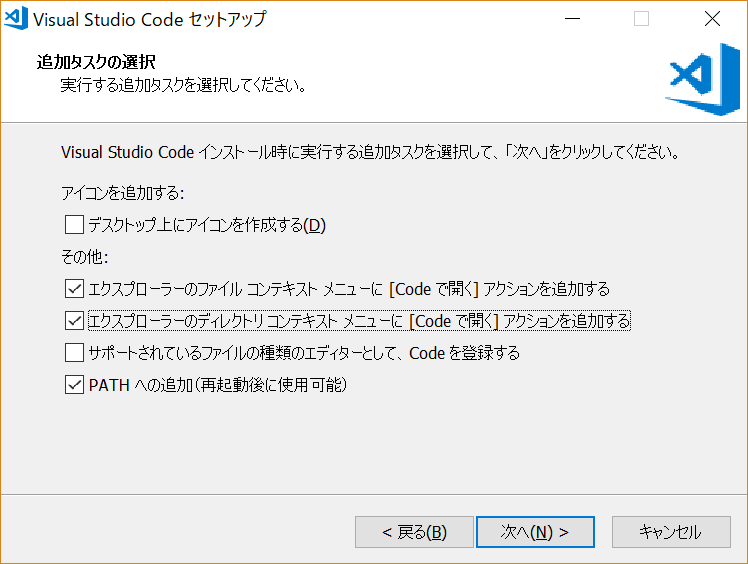
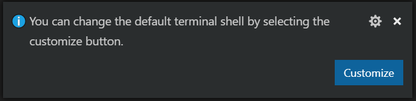
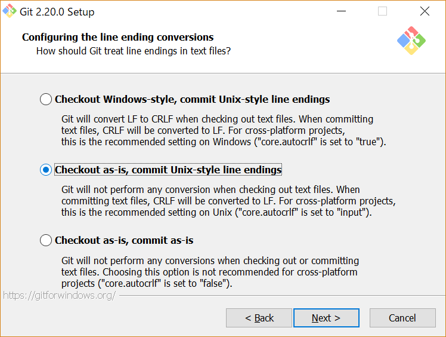

Windows 10 で Laravel を開発する
=====

Update: 2020-07-11


私自身は「おうちにかえってからは Windows なんか見たくない」と言って Mac を使っているのですが、
世の中そんな人ばかりではないので Windwos 上で Laravel を使う開発の環境を準備する手順を確認してみました。

## エディタ

エディタは Mac で使っているのと同じ Visual Studio Code にします。
ダウンロードページを見ると User Installer というものがあるんですね。
仮想デスクトップ等との関係かな。
https://code.visualstudio.com/Download
から ``VSCodeUserSetup-x64-1.30.1.exe`` をダウンロードしてインストールしました。
オプションは自分の好みで下図の選択だけ、あとはデフォルトです。



Windows 版の場合、コンソールの表示は ``[Ctrl]+@`` ですが、
PowerShell がデフォルトですね。右下に



のような表示が出るので、そこで設定を変更できます。また

File --> Preferences --> Settings --> Features --> Terminal

の ``Integrated > Shell: Windows`` でも変更できます。
コマンドプロンプトの場合は ``C:\Windows\System32\cmd.exe``
PowerShell の場合は ``C:\Windows\System32\WindowsPowerShell\v1.0\powershell.exe``
です。

## PHP

PHP は https://windows.php.net/download#php-7.2 から
ZIP 圧縮されたバイナリをダウンロードして ``C:\php`` に解凍します。
開発環境は Thread Safe 版でいいでしょう。今回は
``php-7.2.13-Win32-VC15-x64.zip`` を使いました。

環境変数 PATH に ``C:\php`` を追加し、
``C:\php\php.ini-development`` をコピーして ``C:\php\php.ini`` を作ります。
``C:\php\php.ini`` の中を見ると拡張モジュールがすべて無効になっています。
以下のようなものをコメント外して有効にすればよいと思います。

```
extension=bz2
extension=curl
extension=fileinfo
extension=gd2
extension=gettext
extension=gmp
extension=intl
extension=ldap
extension=mbstring
extension=exif
extension=openssl
extension=pdo_mysql
extension=pdo_pgsql
extension=pdo_sqlite
extension=shmop
extension=xmlrpc
extension=xsl
```

```
<?php phpinfo(); ?>
```

のようなファイルを作ってそのフォルダに ``CD`` して

```
php -S localhost:8000
```

を実行して、ブラウザで http://localhost:8000 が表示できれば OK です。

``phpunit`` のために ``xdebug`` というモジュールが必要なので、
[xdebugをwindowsのphpに設定する方法で悩んだ件](https://qiita.com/f_uto/items/bd5b2309ea415a6de1ca)
を参考に導入しました。
``php -i`` の実行結果を
https://xdebug.org/wizard.php
に貼り付けて分析してもらうと、

```
Instructions
Download php_xdebug-2.6.1-7.2-vc15-x86_64.dll
Move the downloaded file to C:\php\ext
Edit C:\php\php.ini and add the line
zend_extension = C:\php\ext\php_xdebug-2.6.1-7.2-vc15-x86_64.dll
```

と結果が出るのでその通りにします。
``zend_extension`` の設定の追加は、上記の ``extension`` の後が無難そうです。

composer は https://getcomposer.org/download/ から
``Composer-Setup.exe`` をダウンロードしてインストールします。
``PATH`` が通っているところにある ``php.exe`` を自動検出して設定してくれます。

コマンドプロンプトで ``composer`` を実行して Version と Usage が正常に表示されることを確認します。

## git

git の GUI ツールはたくさんありますが、どれがいいかよくわからないのでとりあえず本家サイト
https://git-scm.com/download/win から
``Git-2.20.0-64-bit.exe`` をダウンロードしてインストールしました。
デフォルトの設定を変更したのは改行コードの扱いだけです。



## その他

テスト用に SQLite を使うので、
[DB Browser for SQLite](http://sqlitebrowser.org/)
をインストールしました。

Windows 10 は標準の ssh クライアントがあるのですね ( 
[Windows10標準のSSHクライアントを使ってみた](https://www.onebizlife.com/windows10-ssh-client-1980)
) 。ssh-keygen も入っていました。

```
C:\Users\michi>ssh-keygen
Generating public/private rsa key pair.
Enter file in which to save the key (C:\Users\michi/.ssh/id_rsa):
```

ssh-agent はサービスとして常駐する形になります。
サービス "OpenSSH Authentication Agent" ( ssh-agent )
を自動実行するように設定して開始すれば
``ssh-add`` コマンドが使えるようになります。

サービスの設定をデフォルトに戻す手順は
http://batcmd.com/windows/10/services/ssh-agent/
です。


## Laravel のプロジェクトを作ってみる

こんな感じで問題なくできました。

```
composer create-project --prefer-dist laravel/laravel blog
cd blog
php artisan serve
```
<del>
## Tamuro のソースを入れてみる

こんな感じで問題なく動きました。

PowerShell の場合

```
git clone https://github.com/MichinobuMaeda/tamuro
cd tamuro
composer install
Copy-Item .env.local .env
New-Item storage\tamuro.sqlite -ItemType File
php artisan list
php artisan migrate:refresh ; .\vendor\bin\phpunit --coverage-html coverage
php artisan migrate:refresh --seed ; php artisan serve --host localhost --port 8000
```

CMD.exe の場合

```
git clone https://github.com/MichinobuMaeda/tamuro
cd tamuro
composer install
copy .env.local .env
どうにかして 0byte の storage\tamuro.sqlite を作る。
php artisan list
php artisan migrate:refresh && .\vendor\bin\phpunit --coverage-html coverage
php artisan migrate:refresh --seed && php artisan serve --host localhost --port 8000
```
</del>
Tag: php phpunit powershell laravel windows git sqlite


