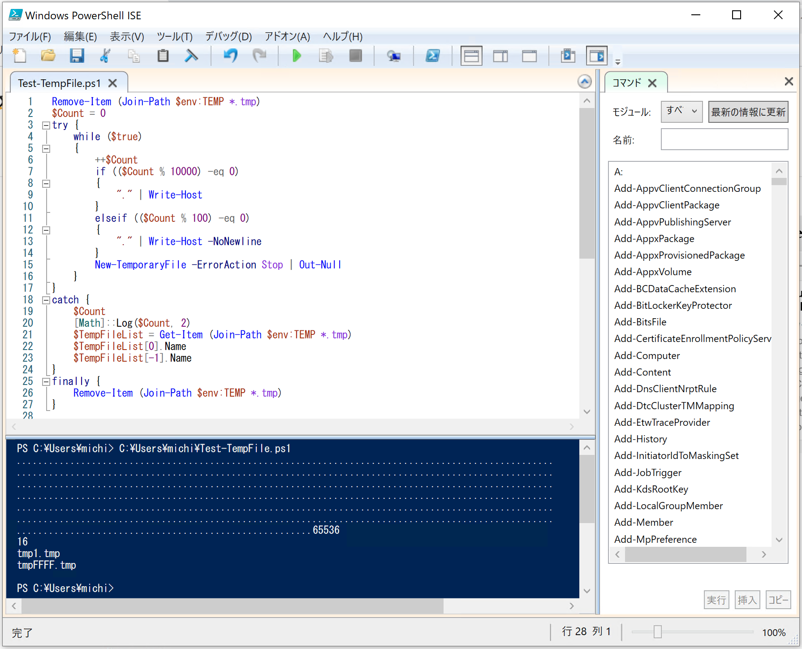

PowerShell の一時ファイルを消さないと 65,536日目に死ぬ
=====

Update: 2020-07-11


65,536日って179年？ 長生きかも。



PowerShell には ``New-TemporaryFile`` というコマンドがあって、これが便利なのですが、作成した一時ファイルを消し忘れるとたいへんなことになります。試してみましょう。

<code powershell>
Remove-Item (Join-Path $env:TEMP *.tmp)
$Count = 0
try {
    while ($true)
    {
        ++$Count
        if (($Count % 10000) -eq 0)
        {
            "." | Write-Host
        }
        elseif (($Count % 100) -eq 0)
        {
            "." | Write-Host -NoNewline
        }
        New-TemporaryFile -ErrorAction Stop | Out-Null
    }
}
catch {
    $Count
    [Math]::Log($Count, 2)
    $TempFileList = Get-Item (Join-Path $env:TEMP *.tmp)
    $TempFileList[0].Name
    $TempFileList[-1].Name
}
finally {
    Remove-Item (Join-Path $env:TEMP *.tmp)
} 
</code>

PowerShell で ``while`` ってあまり使った記憶が無いな。

この処理にはそこそこ時間がかかって、動いているのかどうか心配になるので "." で進捗を表示します。

```
PS > .\Test-TempFile.ps1
....................................................................................................
....................................................................................................
....................................................................................................
....................................................................................................
....................................................................................................
....................................................................................................
.......................................................65536
16
tmp1.tmp
tmpFFFF.tmp
```

``New-TemporaryFile`` は環境変数 ``TEMP`` の場所に ``tmp1.tmp`` から ``tmpFFFF.tmp`` までのファイルをランダムに（たぶん）生成します。
16進数で 4桁だから 2の 16乗、つまり 65,536個までできるということです。

Tag: powershell
