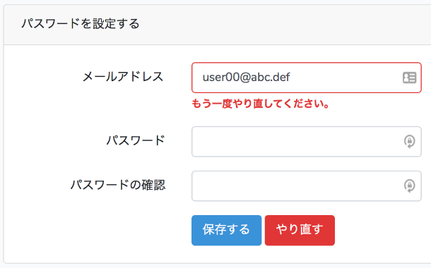

Laraval 5 による開発の手順 #6
=====

Update: 2018-12-22


[Laraval 5 による開発の手順 #5](startlaravel5.html) の続きです。

## パスワードの複雑さのチェックを厳しくする

Laravel 5 が用意してくれている認証機能のパスワードの制限は「 6文字以上」だけです。
私が作成しようとしているシステムとしては弱すぎるので、厳しくして、また、エラーメッセージも変更します。

### 最小の文字数を増やす

まず、文字数は「 8文字以上」にします。これは簡単で、
``app/Http/Controllers/Auth/ResetPasswordController.php`` の
``min:6`` を ``min:8`` に変更するだけです。

メッセージの日本語化は ``/resources/lang/ja/validation.php`` の

```
    'min'                  => [
        ...
        'string'  => 'The :attribute must be at least :min characters.',
```

を

```
    'min'                  => [
        ...
        'string'  => ':attribute は :min文字以上にしてください。',
```

に書き換えて、

```
    'attributes' => [
        'password' => 'パスワード',
    ],
```

を追加します。

### ３種類の文字種の使用を強制する

次に、アルファベット大文字、アルファベット小文字、数字の３種類の文字種の使用を求める設定を作成します。これは
validation の既存のセットでは足りないので自分で作ります。

```
php artisan make:rule Password
```

で作成した ``app/Rules/Password.php`` に定義を書いて、
``app/Http/Controllers/Auth/ResetPasswordController.php`` に

```
            'password' => ['required', 'confirmed', 'min:8', new Password()],
```

と追加します。

## パスワードリセットをやり直すボタン

パスワードリセットでタイムアウトした場合や、メールアドレスが違っていた場合は最初からやり直す必要があるのですが、
Larval 5 が用意してくれている UI ではわかりにくいです。
最初からやり直すことになるのは概ね E-mail 欄でエラーが出る場合なので、
その条件で表示するボタンを ``reset.blade.php`` 追加します。

```
      <div class="col-md-6 offset-md-4 form-inline">
        <button type="submit" class="btn btn-primary">
          {{ __('Save') }}
        </button>
        @if ($errors->has('email'))
        &nbsp;
        <a class="btn btn-danger" href="{{ route('password.request') }}">
          {{ __('Retry') }}
        </a>
        @endif
      </div>
```

上位の ``div`` の ``class`` に ``form-inline`` を追加するとボタンが横に並んでくれます。
見た目はこんな感じになります。



この後に作成する管理者からの招待メールを受けた場合でも、これで良さそうです。

## 招待メール送信機能を追加する

招待メールを送信すると言っても処理内容はパスワードリセットとほとんど変わりません。
本人ではなく管理者がパスワードリセットメール送信を代行するだけです。
しかしながら実用のためには以下のことをしたいです。

  - タイムアウトはパスワードリセットより長くする。
  - 管理者としてログイン中に利用者の一覧からボタン一つで送信する。

まず、パスワードリセットのタイムアウトは ``config/auth.php`` に

```
    'passwords' => [
        'users' => [
            'provider' => 'users',
            'table' => 'password_resets',
            'expire' => 60
        ],
    ],
```

と設定されています。単位は分で、つまり 1時間です。
これは、本人がパスワードリセットするには長すぎるくらいですが、
招待メールでは短すぎます。

それから ``ResetPasswordController``　は

```
    public function __construct()
    {
        $this->middleware('guest');
    }
```

となっていて、管理者がログインしたままだと利用できません。
この設置を変えて何かセキュリティの穴ができてもイヤなので、
管理者用の機能を追加することにします。

追記 2018-12-23: 上記のタイムアウト値の処理は無くして、
招待メールを受け取ったら既存のパスワードリセットのページを開いてもらう形に変更しました。

## 招待メールのタイムアウトを変更する

``vendor/laravel/framework`` の下を見たところ、パスワードリセットのタイムアウトの判定は
``password_resets`` テーブルの ``created_at``
に上記の ``expire`` の値を足して現在の日時と比較しているだけのようです。
きれいなやり方ではありませんが、既存の処理を生かすため、
``created_at`` に未来の日時を設定してタイムアウトを延長してもらうことにします。

その前に、ついでに local のテストで利用するタイムアウトを短くしたいです。
``config/auth.php`` を書き換えて、

```
            'expire' => intval(env('APP_PASSWORD_RESET_EXPIRE', 60))
```

``.env`` で

```
APP_PASSWORD_RESET_EXPIRE=1
```

という形で設定できるようにしました。

招待メールのタイムアウトも ``.env`` に

```
APP_INVITATION_EXPIRE=1
```

のように設定します。この値は、次の項の
``app/Services/UsersService.php`` で使います。

## 管理者専用のページを追加する

以下、たくさんのソースファイルを追加編集するのですが、すべてを載せるとたいへんなのでかいつまんで。

Laravel 5 の Authorization は Controller に設定することもできますが、
私の好みで Route の設定に入れることにします。
システムの入り口の姿形が Route の一覧として把握できるからです。

まず User モデルの操作についての Policy を作成します。

```
php artisan make:policy UserPolicy --model=User
```

で app/Policies/UserPolicy.php に Policy
``view``, ``create``, ``update``, ``delete``, ``restore``, ``forceDelete``
ができます。 ``restore`` と ``forceDelete`` は使わない、というかよくわからないので削除します。
そこにポリシー ``list`` と ``invite`` を追加します。

私が作成しようとしているシステムでは、管理者でない利用者はいずれかのグループに所属するユーザの一覧
( ``GET /groups/{group_id}/users`` ) を参照しますが、すべてのユーザの一覧
( ``GET /users`` ) は必要はありません。そんなにたくさん表示されても困るだろうと思います。
また、ユーザの出入りがほとんど無いシステムなので、以下のように権限を設定します。

  * ``view`` : ログインしている人全員
  * ``create`` : 全体の管理者
  * ``update`` : 本人、本人が所属するグループの管理者、全体の管理者
  * ``delete`` : 全体の管理者
  * ``list`` : 本人が所属するグループの管理者、全体の管理者
  * ``invite`` : 本人が所属するグループの管理者、全体の管理者

``app/Providers/AuthServiceProvider.php`` に以下のように設定を追加すると、
``app/Policies/UserPolicy.php`` を使ってもらえるようになります。

```
    public function boot()
    {
        $this->registerPolicies();

        Gate::resource('users', 'App\Policies\UserPolicy', [
            'view' => 'view',
            'create' => 'create',
            'update' => 'update',
            'delete' => 'delete',
            'list' => 'list',
            'invite' => 'invite',
        ]);
    }
```

次に ``/users/{user}...`` のような Route で該当する
User モデルを取得して Policy や Controller に引数で渡してもらうため、
``app/Providers/RouteServiceProvider.php`` に次のように設定します。

```
    public function boot()
    {
        parent::boot();

        Route::model('user', User::class);
    }
```

便利な世の中になったものです。

これで routes/web.php にアクセス制限を設定できるようになります。

```
Route::post(
  '/users/{user}/invite',
  'UsersController@invite'
)->name('users.invite')->middleware('can:users.invite,user');
```

処理や UI は以下のファイルに定義しました。

  * ``app/Http/Controllers/UsersController.php``
  * ``app/Services/UsersService.php``
  * ``app/Notifications/InvitationMailNotification.php``
  * ``resources/views/users_list.blade.php``
  * ``resources/views/users_invite_email.blade.php``

----

ここまで作ったものは https://github.com/MichinobuMaeda/tamuro.git
のタグ ``startlaravel6`` です。チェックアウトの手順は
[Laraval 5 による開発の手順 #2](startlaravel2.html) の末尾をご参照ください。
チェックアウト済みであれば

```
git pull
git checkout tags/startlaravel6
```

としていただければいいです。

----

このシリーズはいったんここまでとします。

Tag: PHP Laravel
